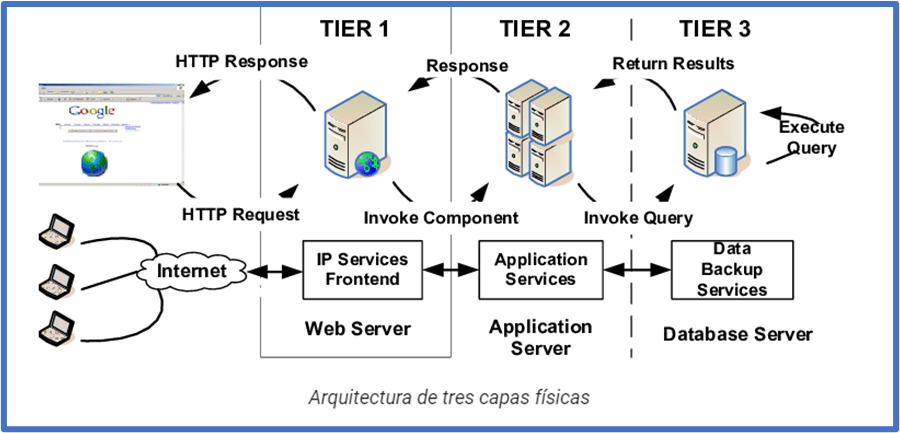
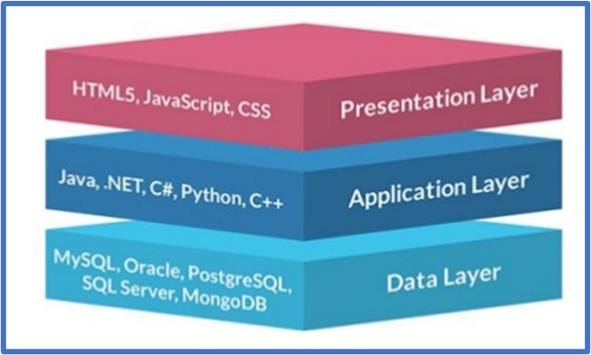
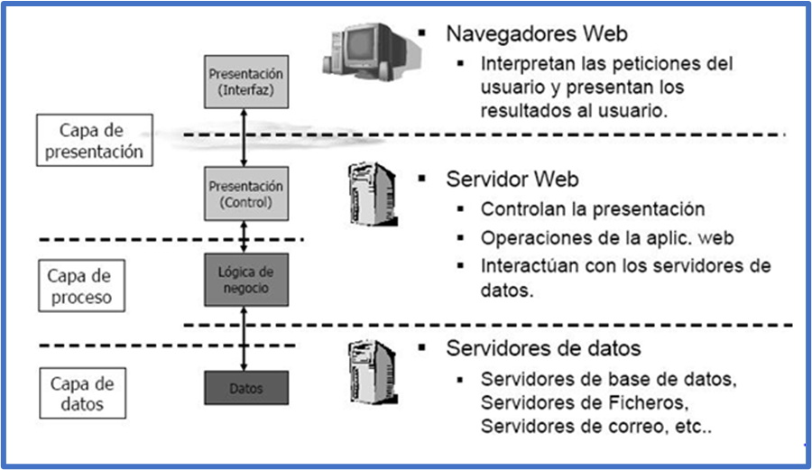
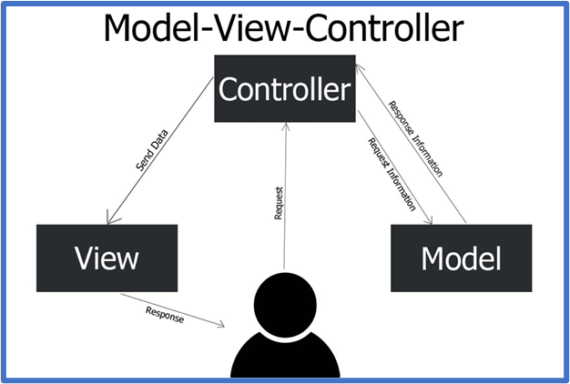
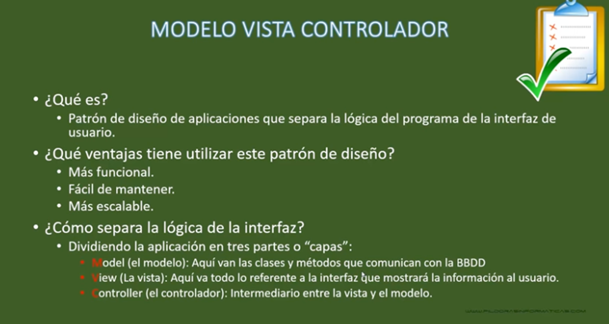
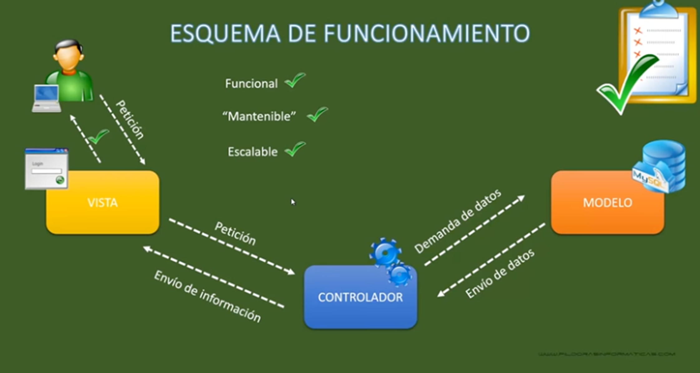
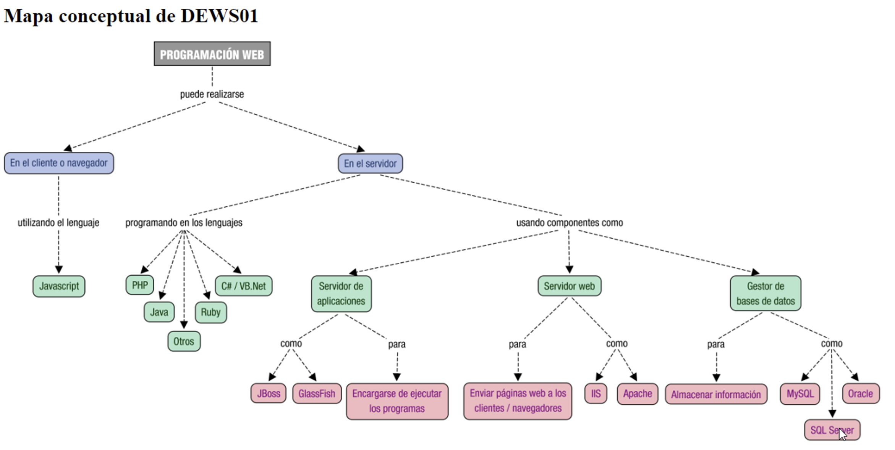
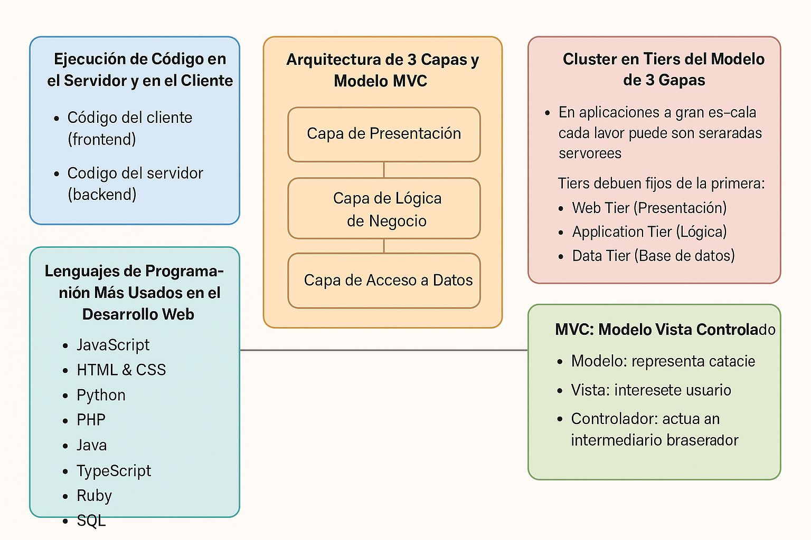

## UD1- Sesión 2: Arquitectura de 3 capas y modelo MVC

# 1. Ejecución de código en el Servidor y en el Cliente

Como vimos, cuando tu navegador solicita a un servidor web una página, es posible que antes de enviártela haya tenido que ejecutar, por sí mismo o por delegación, algún programa para obtenerla. Ese programa es el que genera, en parte o en su totalidad, la página web que llega a tu equipo. En estos casos, **el código se**
**ejecuta en el entorno del servidor web** .

Además, cuando una página web llega a tu navegador, es también posible que incluya algún programa o fragmentos de código que se deban ejecutar. Ese código, normalmente en lenguaje **JavaScript**, se ejecutará en tu navegador y, además de poder modificar el contenido de la página, también puede llevar a cabo acciones como la animación de textos u objetos de la página o la comprobación de los datos que introduces en un formulario.

**Estas dos tecnologías se complementan una con otra.** Así, volviendo al ejemplo del correo web:

* el programa que se encarga de obtener tus mensajes y su contenido de una base de datos se ejecuta en el entorno del **servidor** ,
* mientras que tu **navegador** ejecuta, por ejemplo, el código encargado de avisarte cuando quieres enviar un mensaje y te has olvidado de poner un texto en el asunto.
* desde hace unos años existe una técnica de desarrollo web conocida como **AJAX** , que nos posibilita realizar programas en los que el código JavaScript que se ejecuta en el navegador pueda comunicarse con un servidor de Internet para obtener información con la que, por ejemplo, modificar la página web actual.

!!! note "Actividad"

```
Busca algún **enlace de Youtube** que explique este modelo
```

# 2 Arquitectura de tres capas

Antes de hablar de cada una de estas capas tenemos que distinguir entre capas **físicas** (*tier* ) y capas **lógicas** (*layer* ).

**Tier** **(nivel/escalón)**

Capa física de una arquitectura. Supone un nuevo elemento hardware separado físicamente. Las capas físicas más alejadas del cliente están más protegidas, tanto por firewalls como por VPN.

Ejemplo de arquitectura en tres capas físicas (*3 tier* ):

* **Servidor Web**
* **Servidor de Aplicaciones**
* **Servidor de bases de datos**

 

## 2.1 Cluster en tiers del modelo 3 capas

No debemos confundir las capas con la cantidad de servidores. Actualmente se trabaja con arquitecturas
con **múltiples servidores** en una misma capa física mediante un **cluster**, para ofrecer tolerancia a errores y escalabilidad horizontal.

En una aplicación puedes distinguir, de forma general, \*\***funciones de presentación** \*\* (se encarga de dar formato a los datos para presentárselo al usuario final), **lógica** (utiliza los datos para ejecutar un proceso y obtener un resultado), **persistencia**  (que mantiene los datos almacenados de forma organizada) y **acceso** (que obtiene e introduce datos en el espacio de almacenamiento).

Cada capa puede ocuparse de una o varias de las funciones anteriores. Por ejemplo, en las aplicaciones de **3 capas** nos podemos encontrar con:

* Una **capa cliente** , que es donde programarás todo lo relacionado con la interface de usuario,
  esto es, la parte visible de la aplicación con la que interactuará el usuario.
* Una **capa intermedia** donde deberás programar la funcionalidad de tu aplicación.
* Una **capa de acceso a datos** , que se tendrá que encargar de almacenar la información
  de la aplicación en una base de datos y recuperarla cuando sea necesario.

Como se observa, cada una de las capas se puede implementar con diferentes lenguajes de programación y/o
herramientas.

1. **Capa de Presentación** (Front-End): Desarrollada con HTML, CSS, y JavaScript.
2. **Capa Lógica** (Back-End): Implementada en lenguajes como Python o Java.
3. **Capa de Datos**: Uso de bases de datos como MySQL o MongoDB.

 

Así, en la siguiente figura también se representan los aspectos generales de estas tres capas.

 

!!! note "Actividad Capas de presentación, aplicación y datos"

    Busca alguna imagen en internet de este**modelo de 3 capas** y coméntala brevemente en repositorio, debatiremos en clase las capturas que hemos encontrado.

# 3 MVC: Modelo Vista Controlador

***Model-View-Controller***\*\* o Modelo-Vista-\*\* C**ontrolador** es un modelo de arquitectura que **separa** los datos y la lógica de negocio respecto a la interfaz de usuario y el componente encargado de gestionar los eventos y las comunicaciones.

Al separar los componentes en elementos conceptuales permite reutilizar el código y mejorar su
organización y mantenimiento. Sus elementos son:

* **Modelo** : representa la información y gestiona todos los accesos a ésta, tanto consultas como actualizaciones provenientes, normalmente, de una base de datos. Se accede via el controlador.
* **Controlador** : Responde a las acciones del usuario, y realiza peticiones al modelo para solicitar información. Tras recibir la respuesta del modelo, le envía los datos a la vista.
* **Vista** : Presenta al usuario de forma visual el modelo y los datos preparados por el controlador. El usuario interactúa con la vista y realiza nuevas peticiones al controlador.

Lo estudiaremos en más detalle al profundizar en el uso de los **frameworks PHP**

 

Características





# 4 Lenguajes de Programación Más Usados en el Desarrollo Web

### 4.1 PHP

PHP es un lenguaje de scripting del lado del servidor ampliamente utilizado para el desarrollo web. Fue creado en 1994 y es conocido por su facilidad de uso y su capacidad para generar páginas web dinámicas.

**Ejemplo Básico en PHP**

```php
<?php
echo "Hola, mundo!";
?>
```

Cuando un servidor web ejecuta este código, enviará al cliente un simple texto "Hola, mundo!".

PHP sigue siendo una tecnología muy utilizada en entorno servidor, especialmente en:

* WordPress;
* Laravel;
* Symfony;
* PrestaShop;
* Moodle;
* aplicaciones empresariales;
* proyectos CRUD;
* APIs REST.

PHP 8.4 introdujo novedades como property hooks, visibilidad asimétrica, mejoras en DOM, mejoras de rendimiento y correcciones generales. ([PHP][5]) En 2026, la página oficial de PHP ya recoge versiones de mantenimiento de PHP 8.5 y PHP 8.4, por lo que en clase conviene hablar de PHP moderno y evitar prácticas antiguas. ([PHP][6])

Buenas prácticas actuales en PHP:

* uso de `strict_types`;
* programación orientada a objetos;
* Composer;
* namespaces;
* autoloading;
* PDO;
* frameworks modernos;
* control de dependencias;
* variables de entorno;
* separación de responsabilidades;
* testing.

---

### 4.2 JavaScript/TypeScript en servidor

 JavaScript es el lenguaje del lado del cliente más popular. Se ejecuta en el navegador del usuario y se utiliza para crear interacciones dinámicas en la página web. También puede usarse en el backend con tecnologías como Node.js.

**Ejemplo Básico en JavaScript**

```javascript
document.getElementById("mensaje").innerHTML = "¡Hola desde JavaScript!";
```

Este código busca un elemento con el ID `mensaje` y cambia su contenido a "¡Hola desde JavaScript!".

JavaScript también puede ejecutarse en servidor mediante Node.js, Bun o Deno.

Usos habituales:

* APIs REST;
* aplicaciones en tiempo real;
* herramientas de desarrollo;
* backend para aplicaciones SPA;
* renderizado SSR con frameworks full-stack.

Frameworks habituales:

* Express.
* NestJS.
* Fastify.
* Next.js.
* Nuxt, en el ecosistema Vue.

---

### 4.3 Python, Java, C# y otros entornos

**Python**

Python es un lenguaje de propósito general que también se utiliza en el desarrollo web, especialmente en el backend con frameworks como Django o Flask.

Ejemplo Básico en Python (con Flask)

```python
from flask import Flask

app = Flask(__name__)

@app.route("/")
def hello():
    return "¡Hola desde Flask!"

if __name__ == "__main__":
    app.run()
```

Este código crea una pequeña aplicación web que devuelve "¡Hola desde Flask!" cuando se accede a la ruta raíz (`/`).

Otros lenguajes relevantes en servidor:

| Lenguaje | Frameworks habituales  | Usos                               |
| -------- | ---------------------- | ---------------------------------- |
| Python   | Django, Flask, FastAPI | APIs, datos, IA, backend           |
| Java     | Spring Boot            | aplicaciones empresariales         |
| C#       | ASP.NET Core           | backend empresarial y APIs         |
| Ruby     | Ruby on Rails          | desarrollo rápido de aplicaciones |
| Go       | Gin, Fiber             | servicios eficientes y APIs        |
| Rust     | Axum, Actix            | sistemas de alto rendimiento       |

---

# 5. Integración con lenguajes de marcas

El desarrollo en servidor se integra con HTML de distintas formas.

### 5.1 PHP embebido en HTML

Ejemplo básico:

```php
<h1>Bienvenido, <?= htmlspecialchars($nombre) ?></h1>
```

Aunque es útil para aprender, en proyectos profesionales conviene separar la lógica de la presentación.

---

### 5.2 Motores de plantillas

Los motores de plantillas permiten generar HTML dinámico de forma más limpia.

Ejemplos:

| Tecnología | Motor de plantillas  |
| ----------- | -------------------- |
| Laravel     | Blade                |
| Symfony     | Twig                 |
| Django      | Django Templates     |
| Express     | EJS, Pug, Handlebars |
| ASP.NET     | Razor                |

Ejemplo con Blade:

```blade
<h1>Bienvenido, {{ $usuario->name }}</h1>
```

---

### 5.3 APIs y frontend separado

En aplicaciones modernas, el servidor puede devolver JSON y el cliente generar la interfaz.

```text
Backend Laravel → JSON → Frontend React/Vue/Angular
```

Este enfoque es habitual cuando se desarrollan:

* aplicaciones móviles;
* paneles administrativos modernos;
* aplicaciones SPA;
* servicios consumidos por terceros.

---

## 5. Herramientas y frameworks actuales

### Herramientas básicas

| Herramienta                     | Uso                                     |
| ------------------------------- | --------------------------------------- |
| Visual Studio Code / PhpStorm   | Desarrollo                              |
| Git y GitHub                    | Control de versiones                    |
| Composer                        | Gestión de dependencias PHP            |
| Docker                          | Entornos reproducibles                  |
| XAMPP/Laragon/DDEV              | Desarrollo local                        |
| Postman/Insomnia/Thunder Client | Pruebas de APIs                         |
| MySQL/PostgreSQL/SQLite         | Bases de datos                          |
| GitHub Actions                  | Automatización e integración continua |

---

### Frameworks backend

| Framework    | Lenguaje   | Características                                |
| ------------ | ---------- | ----------------------------------------------- |
| Laravel      | PHP        | MVC, Eloquent, Blade, rutas, middleware, APIs   |
| Symfony      | PHP        | Componentes reutilizables, arquitectura robusta |
| Express      | JavaScript | Minimalista, flexible                           |
| NestJS       | TypeScript | Modular, orientado a arquitectura               |
| Django       | Python     | Completo, seguro, rápido                       |
| FastAPI      | Python     | APIs modernas y documentación automática      |
| Spring Boot  | Java       | Muy usado en empresa                            |
| ASP.NET Core | C#         | Alto rendimiento y ecosistema Microsoft         |

---

# Mapa conceptual



# Actividad Entregable

!!! success "Entregable"

    Continúa tu presentación de la entrega de la UD1recabando información y conclusiones de este tema.

- Integra las actividades/curiosidades que has realizado durante su desarrollo.

  Tienes más info en la sección "[Actividad entregable](Entregable.md)"

# Diagrama


