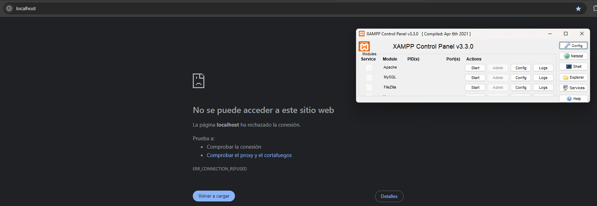
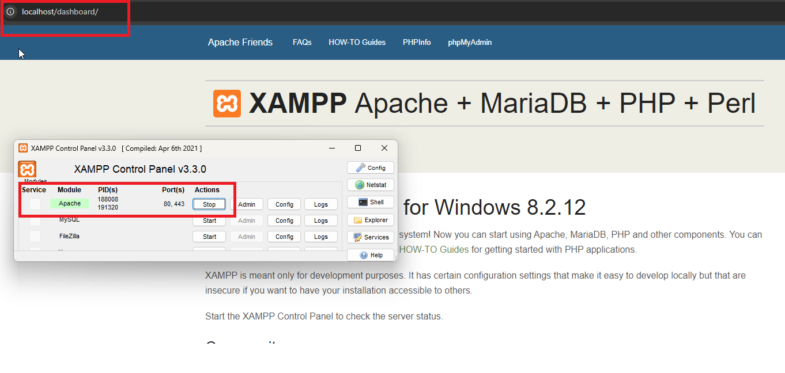
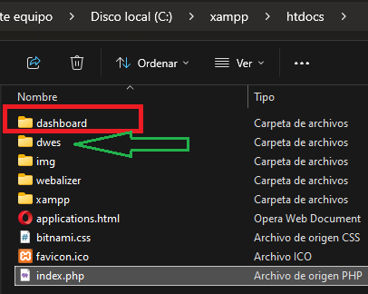
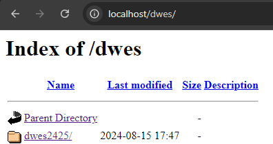
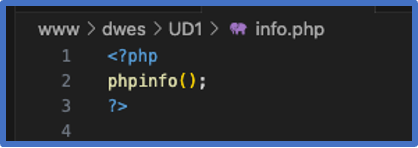
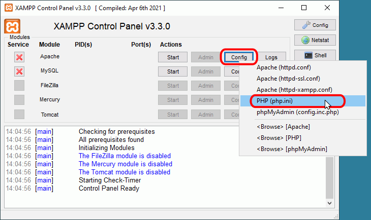
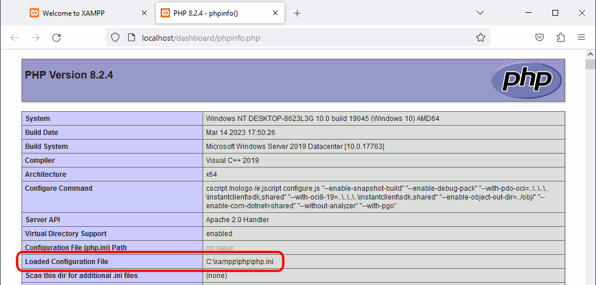
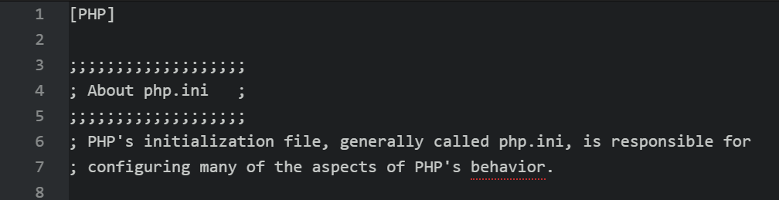
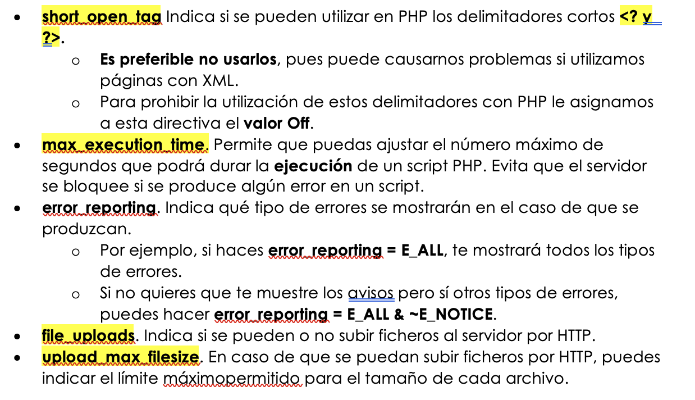
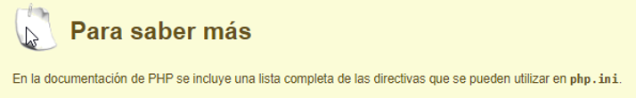

## UD1- Sesión 3: Configurando el entorno PHP

Para realizar las primeras prácticas y conocer el lenguaje **PHP**, tendremos que configurar un servidor local que puede hacerse a través del paquete **XAMPP**

**XAMPP** ([https://www.apachefriends.org/es/index.html](https://www.apachefriends.org/es/index.html)) es una distribución compuesta con el software necesario para desarrollar en entorno servidor. Se compone de las siguientes herramientas en base a sus siglas:

* X para el sistema operativo (de ahí que se conozca tamnbién como LAMP o WAMP).
* A para Apache.
* M para MySQL / MariaDB. También incluye phpMyAdmin para la administración de la base de datos desde un interfaz web.
* P para PHP.
* la última P para Perl.

Desde la propia página se puede descargar el archivo ejecutable para el sistema operativo de nuestro ordenador. Se recomienda leer
la FAQ de cada sistema operativo con instrucciones para su puesta en marcha.

Si lo hacemos con este tipo de paquete XAMPP, tendremos nuestro servidor local y en nuestro equipo, una carpeta llamada htdocs donde se alojarán todos nuestros archivos.


Existen otras formas de crearnos un entorno de desarrollo para PHP como puede ser es a través de **Docker**, con las ventajas que conlleva tener las mismas características a la hora de trabajar en equipo, pero por ahora con este método será suficiente.

## 5.1 Introducción a la Instalación del Entorno PHP en Windows

PHP es un lenguaje de programación del lado del servidor ampliamente utilizado para el desarrollo web. Para comenzar a desarrollar con PHP en un entorno Windows, es necesario seguir algunos pasos para instalar y configurar correctamente el entorno. A continuación, se presenta una guía básica para instalar PHP en Windows:

1. [ **Descargar PHP** : Visita el sitio web oficial de PHP y descarga la versión más reciente compatible con tu sistema operativ](https://www.apachefriends.org/es/download.html)o-
2. **Descomprimir el archivo** : Una vez descargado el archivo ZIP, descomprímelo en una carpeta de tu elección, por ejemplo, `C:\php`.
3. **Configurar las variables de entorno** : Añade la ruta de la carpeta PHP a las variables de entorno del sistema para que puedas ejecutar comandos PHP desde cualquier terminal.
4. **Configurar el servidor web** : Si utilizas Apache, edita el archivo `httpd.conf` para incluir el módulo de PHP. Si prefieres usar el servidor web integrado de PHP, simplemente ejecuta `php -S localhost:8000` desde la terminal.
5. **Verificar la instalación** : Crea un archivo `index.php` con el siguiente contenido y colócalo en la carpeta raíz de tu servidor web:**PHP**

```php
   <?php
   phpinfo();
   ?>
```

   Luego, abre tu navegador y navega a `http://localhost/index.php` para verificar que PHP está funcionando correctamente.

Con estos pasos, tendrás un entorno PHP básico configurado en tu sistema Windows, listo para comenzar a desarrollar aplicaciones web.

### Video: Cómo instalar XAMPP

<iframe width="1236" height="695" src="https://www.youtube.com/embed/Uyq3KbVwz3k" title="Cómo instalar XAMPP en Windows sin problemas PASO a PASO" frameborder="0" allow="accelerometer; autoplay; clipboard-write; encrypted-media; gyroscope; picture-in-picture; web-share" referrerpolicy="strict-origin-when-cross-origin" allowfullscreen></iframe>

## 5.2 Creación de la carpeta dwes en htdocs

Una vez hayas instalado XAMPP, podremos acceder a él a través de cualquier navegador en la dirección "localhost", siempre que tengamos el servicio **Apache** ejecutado. De lo contrario apararecerá:



Si todo está correcto, se podrá ver el panel inicial desde localhost



Esto lo hace porque el archivo **index.php** lo redirige a la carpeta **dashboard**, como se apreciaba en la URL de la imagen anterior.

Así, podremos crear en el directorio htdocs, que en Windows está en

```
C:\xampp\htdocs
```

**Crea** una nueva carpeta llamada dwes, y es dentro de esta donde crearemos los archivos y carpetas a lo largo del curso.



Si todo está correcto, cambiaremos "~~dashboard~~" por "**dwes**" para que nos dirija y nos muestre nuestros archivos y carpetas.



### Incluir php al PATH

Para que PHP funcione correctamente, necesitamos **agregar PHP a las variables de entorno de Windows** , algo muy necesario si queremos por ejemplo que php nos quede de manera global, nos servira para el manejador de dependencias composer y si queremos ejecutar scripts php en la consola.

Lo primero que debemos hacer es  **acceder a las variables de entorno de windows** , podemos hacerlo usando el buscador y digitando la palabra “variables” solamente y vermos un item con el nombre **“Editar las variables de entorno del sistema”.**

Complétalo usando el[ siguiente enlace](https://render2web.com/php/agregar-php-a-las-variables-de-entorno-de-windows/) o algún recurso o vídeo similar.

## 5.3 Programación Web con PHP

PHP es un lenguaje de guiones de propósito general, pero diseñado para el desarrollo de **páginas web dinámicas** utilizando código embebido dentro del lenguaje de marcas. Su sintaxis está basada en la de C / C++, y por lo tanto es muy similar a la de Java. Aunque lo puedes hacer de otras formas, los delimitadores recomendados para incluir código PHP dentro de una página web son **`<?php** **y ?>`.**



### Hola Mundo en PHP

Para comenzar a practicar con PHP, lo haremos mediante la siguiente [guía](5_holamundo.md "Guía para el primer programa PHP")

### El archivo php.ini

El archivo de configuración de PHP es el archivo  **php.ini** , un archivo de texto sin formato. En php.ini las líneas comentadas empiezan por el carácter punto y coma (;).

En Windows, el archivo php.ini se encuentra en el directorio **C:\xampp\php\php.ini**

Se puede abrir directamente el archivo **php.ini** haciendo clic en el botón "Config" correspondiente a Apache y eligiendo opción correspondiente:

El código se ejecuta por un entorno de ejecución con el que se integra el servidor web (normalmente utilizando Apache con el módulo  **mod_php** ). La configuración tanto del servidor web Apache, como de PHP, se realiza por medio de ficheros de  **configuración** .

* El de Apache es  **httpd.conf** , y
* el de PHP es  **php.ini** .
* Este fichero, **php.ini** , puede encontrarse en distintas ubicaciones. La función **phpinfo() **que ejecutaste antes te informa, entre otras muchas cosas, del lugar en que se encuentra almacenado el fichero **php.ini **en tu ordenador.** **
* En entornos Linux suele ser en ****/etc/php5/apache2/php.ini****
* En entornos Windows se suele ubicar en: **C:\xampp\php\php.ini , C:\wamp\bin\apache\apache2.4.51\bin\php.ini ...**







### Directivas php.ini

Se comentan a continuación algunas directivas de configuración de PHP, aunque también se puede consultar el [manual de PHP](https://www.php.net/manual/en/ini.core.php). Antes de modificar cualquier archivo de configuración, se recomienda hacer una copia de seguridad del archivo de configuración original.

En el archivo de **configuración** php.ini, las líneas que comienzan por **;** (punto y coma) son líneas comentadas, es decir, que no se tendrán en cuenta cuando PHP cargue el archivo. En el archivo de configuración se pueden encontrar bloques de varias líneas comentadas que explican el significado de una directiva y más adelante una línea sin comentar que establece el valor de la directiva. Un error de principiante bastante común es modificar el valor de la directiva en una línea comentada, lo que no sirve para nada.

Algunas de las directivas más utilizadas que figuran en el fichero **php.ini **son:





[https://www.php.net/manual/es/ini.list.php](https://www.php.net/manual/es/ini.list.php)

[https://www.mclibre.org/consultar/php/otros/php-configuracion-1.html](https://www.mclibre.org/consultar/php/otros/php-configuracion-1.html)

Referencias

# 5.4 Actividades para Trabajar con el Archivo `php.ini` en XAMPP

## Preámbulo: Hacer una Copia de Seguridad

Antes de realizar cualquier modificación, es crucial hacer una copia de seguridad del archivo `php.ini` original para evitar problemas si se produce un error.

1. **Navega a la carpeta donde se encuentra el archivo `php.ini`.**
   - Ruta típica en XAMPP: `C:\xampp\php\php.ini`.
   - Haz una copia de seguridad del archivo, por ejemplo, renómbralo a `php.ini.backup`.

---

## Actividades

### 1. Modificar el Límite de Memoria

- **Tarea:** Aumenta el límite de memoria disponible para PHP.
- **Instrucción:** Busca la línea `memory_limit` y cámbiala a `memory_limit = 256M`.

### 2. Habilitar Errores de PHP

- **Tarea:** Configura PHP para que muestre todos los errores y advertencias.
- **Instrucción:** Establece `display_errors = On` y `error_reporting = E_ALL`.

### 3. Configurar el Límite de Tiempo Máximo de Ejecución

- **Tarea:** Cambia el tiempo máximo de ejecución de un script PHP.
- **Instrucción:** Modifica `max_execution_time` a `max_execution_time = 60` segundos.

### 4. Aumentar el Tamaño Máximo de Subida de Archivos

- **Tarea:** Incrementa el tamaño máximo permitido para la subida de archivos.
- **Instrucción:** Modifica `upload_max_filesize` a `upload_max_filesize = 50M` y `post_max_size = 50M`.

### 5. Configurar la Zona Horaria

- **Tarea:** Establece la zona horaria predeterminada para las funciones de fecha y hora de PHP.
- **Instrucción:** Busca `date.timezone` y ajusta según tu zona horaria, por ejemplo: `date.timezone = "America/Mexico_City"`.

### 6. Habilitar Extensiones de PHP

- **Tarea:** Activa una extensión de PHP que no esté habilitada por defecto.
- **Instrucción:** Descomenta (elimina el `;`) la línea correspondiente a la extensión deseada, por ejemplo, `extension=gd`.

### 7. Configurar el Manejador de Sesiones

- **Tarea:** Cambia el tiempo de expiración de una sesión de PHP.
- **Instrucción:** Modifica `session.gc_maxlifetime` a `session.gc_maxlifetime = 3600` (1 hora).

### 8. Configurar el Error Log

- **Tarea:** Establece una ruta específica para guardar los registros de errores de PHP.
- **Instrucción:** Ajusta `error_log` a `error_log = "C:\xampp\php\logs\php_error.log"`.

### 9. Ajustar la Configuración del OpCache

- **Tarea:** Optimiza el rendimiento de PHP activando el OpCache.
- **Instrucción:** Busca las configuraciones de `opcache` y asegúrate de que `opcache.enable = 1` y `opcache.memory_consumption = 128`.

### 10. Personalizar el `max_input_vars`

- **Tarea:** Aumenta el número máximo de variables de entrada para prevenir errores al enviar formularios grandes.
- **Instrucción:** Modifica `max_input_vars` a `max_input_vars = 3000`.

---

## Finalización

Después de realizar las modificaciones, guarda el archivo `php.ini` y reinicia el servidor Apache desde el panel de control de XAMPP para que los cambios surtan efecto.
