## UD 2 El lenguaje PHP. Básico 2

**Duración Estimada**: 8 sesiones, 16 horas

??? note "RA2 Escribe sentencias ejecutables por un servidor Web reconociendo y aplicando procedimientos de **integración del código en lenguajes de marcas**."

    > *  A Se han reconocido los mecanismos de generación de páginas Web a partir de lenguajes de marcas con código embebido.
    > *  B Se han identificado las principales tecnologías asociadas.
    > *  C Se han utilizado etiquetas para la inclusión de código en el lenguaje de marcas.
    > *  D Se ha reconocido la sintaxis del lenguaje de programación que se ha de utilizar.
    > *  E Se han escrito sentencias simples y se han comprobado sus efectos en el documento resultante.
    > *  F Se han utilizado directivas para modificar el comportamiento predeterminado.
    > *  G Se han utilizado los distintos tipos de variables y operadores disponibles en el lenguaje.
    > *  H Se han identificado los ámbitos de utilización de las variables.

??? note "RA3 Escribe bloques de sentencias embebidos en lenguajes de marcas, seleccionando y utilizando las **estructuras de programación**. "

    > *  A Se han utilizado mecanismos de**decisión** en la creación de bloques de sentencias.
    > *  B Se han utilizado **bucles** y se ha verificado su funcionamiento.
    > *  C Se han utilizado «**arrays**» para almacenar y recuperar conjuntos de datos.
    > *  D Se han creado y utilizado **funciones**.
    > *  E Se han utilizado **formularios** Web para interactuar con el usuario del navegador Web.
    > *  F Se han empleado métodos para **recuperar** la información introducida en el formulario.
    > *  G Se han añadido **comentarios** al código

??? note "OBJETIVOS SEMANALES"

    Instalar Entorno PHP

    Crear y compartir Repositorio GitHub

    Primeros programas PHP y subir al repositorio


## Introducción

En la clase anterior estudiamos los **tipos y el ámbito** de las variables.

Veamos ahora algunos detalles como otros elementos del lenguaje que te permitan crear programas completos en PHP.

Los programas escritos en PHP, además de encontrarse estructurados normalmente en **varias páginas** suelen incluir en una misma página **varios bloques de código**.

* Cada bloque de código debe ir entre **delimitadores**, y en caso de que genere alguna salida, ésta se introduce en el código HTML en el mismo punto en el que figuran las instrucciones en PHP.

Por ejemplo, en las siguientes líneas tenemos dos bloques de código en PHP:

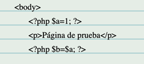

Aunque no se utilice el valor de las variables, en elsegundo bloque de código la variable **$a** mantiene el valor 1 que se le ha asignado anteriormente

---

# 1 Imprimiendo por pantalla


### Echo, print. Ejemplos

Existen varias formas incluir contenido en la página web a partir del resultado de la ejecución de código PHP.

* La forma más sencilla y que ya hemos usado es  **echo** , que no devuelve nada ( **void** ), y genera como salida el **texto de los parámetros que recibe.**
* Otra posibilidad es  **print** , que funciona de forma similar. La diferencia más importante entre **print** y  **echo** , es que print **sólo puede recibir un parámetro** y devuelve siempre 1.
* Tanto **print** como **echo** no son realmente funciones, por lo que no es obligatorio que pongas paréntesis cuando las utilices.

### Programa2: Mostrando por pantalla

!!! success "Programa2.php: Actividad Mostrando por pantalla (Ruta:**dwes/UD2/Entrega1**/Programa2.php) "

    Completa el siguiente bloque HTML para**crear y mostrar** una variable PHP

```
<!DOCTYPE html>
<html lang="es">
<head>
    <meta charset="UTF-8">
    <title>Ejemplo PHP con variables</title>
</head>
<body>
    <h1>Ejemplo de variable en PHP</h1>

    <?php
        // Primer bloque PHP: creamos la variable
        $nombre =;
    ?>

    <p>El valor de la variable es:</p>

    <?php
        // Segundo bloque PHP: mostramos la variable
        echo "<strong> ______</strong>";
    ?>
</body>
</html>

```

!!! success "Programa2.php: Actividad Mostrando por pantalla (Ruta:**dwes/UD2/Entrega1**/Programa2.php) "

    Amplía el programa anterior incorporando los siguientes ejemplos creando apartados con HTML, modifícalos, coméntalos y analiza el resultado

    Añáde alguna captura y comentario a tu readme**Entrega1.md**

    MOSTRAMOS EN CLASE nuestro programa 3

**Ejemplo 1: Uso básico de `echo`**

**Archivo:** `ejemplo1.php`

```php
<?php
echo "Hola, mundo!";
?>
```

**Ejemplo 2: Uso de `echo` con varias cadenas**

**Archivo:** `ejemplo2.php`

```php
<?php
echo "Hola, ", "mundo!";
?>
```

**Ejemplo 3: Uso de `print` con una cadena**

**Archivo:** `ejemplo3.php`

```php
<?php
print "Hola, mundo!";
?>
```

**Ejemplo 4: Uso de `echo` con variables**

**Archivo:** `ejemplo4.php`

```php
<?php
$nombre = "Juan";
echo "Hola, " . $nombre . "!";
?>
```

**Ejemplo 5: Uso de `print` con concatenación**

**Archivo:** `ejemplo5.php`

```php
<?php
$nombre = "Juan";
print "Hola, " . $nombre . "!";
?>
```

**Ejemplo 6: Uso de `echo` con HTML**

**Archivo:** `ejemplo6.php`

```php
<?php
echo "<h1>Hola, mundo!</h1>";
?>
```

**Ejemplo 7: Uso de `print` con HTML**

**Archivo:** `ejemplo7.php`

```php
<?php
print "<h1>Hola, mundo!</h1>";
?>
```

**Ejemplo 8: Uso de `echo` para mostrar números**

**Archivo:** `ejemplo8.php`

```php
<?php
echo 10 + 20;
?>
```

**Ejemplo 9: Uso de `print` para mostrar números**

**Archivo:** `ejemplo9.php`

```php
<?php
print 10 + 20;
?>
```

**Ejemplo 10: Uso de `echo` con comillas dobles y simples**

**Archivo:** `ejemplo10.php`

```php
<?php
echo "Este es un 'ejemplo' con comillas dobles y simples.";
?>
```

```

Estos ejemplos muestran cómo usar `echo` y `print` en PHP para mostrar texto, variables y HTML.
```

# 2. Printf y especificadores de tipo

**Printf** es otra opción para generar una salida desde PHP. Puede recibir varios parámetros, el primero de los cuales es siempre una cadena de texto que indica el **formato** que se ha de aplicar. Esa cadena debe contener un especificador de **conversión** por cada uno de los demás parámetros que se le pasen a la función, y en el mismo orden en que figuran en la lista de parámetros. Por ejemplo:

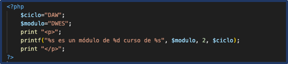

??? note "Cada especificador de conversión va precedido del caracter **%** y se compone de las siguientes partes:"

    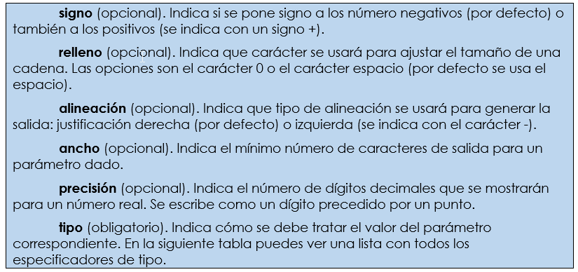

??? note "algunos de los especificadores de tipo para esta función son:"

    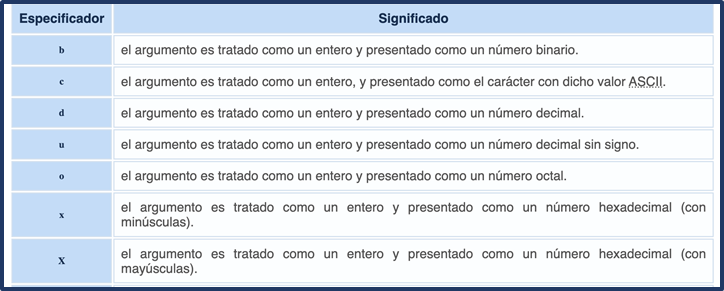

    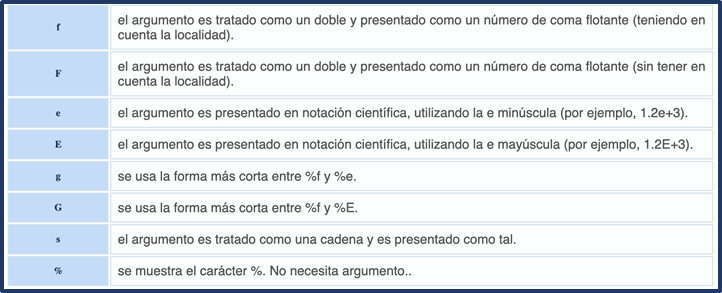

Algunos ejemplos de las especificaciones de formato de la función `printf` de PHP:

### 1. **Formato de Enteros**

```php
- **`%d`**: Formatea un número entero en base 10 (decimal).
  
  ```php
  printf("Número decimal: %d\n", 42); // Salida: Número decimal: 42
```

- **`%b`**: Formatea un número entero como binario.

  ```php
  printf("Número binario: %b\n", 5); // Salida: Número binario: 101
  ```
- **`%o`**: Formatea un número entero como octal.

  ```php
  printf("Número octal: %o\n", 8); // Salida: Número octal: 10
  ```
- **`%x`**: Formatea un número entero como hexadecimal (letras en minúscula).

  ```php
  printf("Número hexadecimal: %x\n", 255); // Salida: Número hexadecimal: ff
  ```
- **`%X`**: Formatea un número entero como hexadecimal (letras en mayúscula).

  ```php
  printf("Número hexadecimal: %X\n", 255); // Salida: Número hexadecimal: FF
  ```

### 2. **Formato de Números con Punto Flotante**

- **`%f`**: Formatea un número de punto flotante (decimal).

  ```php
  printf("Número flotante: %f\n", 3.14159); // Salida: Número flotante: 3.141590
  ```
- **`%.2f`**: Limita el número de decimales a 2.

  ```php
  printf("Número flotante con 2 decimales: %.2f\n", 3.14159); // Salida: Número flotante con 2 decimales: 3.14
  ```
- **`%e`**: Formatea un número de punto flotante en notación científica (minúscula).

  ```php
  printf("Notación científica: %e\n", 12345.6789); // Salida: Notación científica: 1.234568e+4
  ```
- **`%E`**: Formatea un número de punto flotante en notación científica (mayúscula).

  ```php
  printf("Notación científica: %E\n", 12345.6789); // Salida: Notación científica: 1.234568E+4
  ```

### 3. **Formato de Cadenas de Texto**

- **`%s`**: Inserta una cadena de texto.

  ```php
  printf("Hola, %s!\n", "Mundo"); // Salida: Hola, Mundo!
  ```
- **`%.5s`**: Limita la longitud de la cadena a los primeros 5 caracteres.

  ```php
  printf("Cadena limitada: %.5s\n", "Hola, Mundo"); // Salida: Cadena limitada: Hola,
  ```

### 4. **Formato de Caracteres**

- **`%c`**: Imprime un carácter basado en su valor ASCII.

  ```php
  printf("Carácter ASCII 65: %c\n", 65); // Salida: Carácter ASCII 65: A
  ```

### 5. **Alineación y Relleno**

- **`%5d`**: Alinea el número a la derecha en un campo de 5 caracteres de ancho.

  ```php
  printf("Número alineado a la derecha: '%5d'\n", 42); // Salida: Número alineado a la derecha: '   42'
  ```
- **`%-5d`**: Alinea el número a la izquierda en un campo de 5 caracteres de ancho.

  ```php
  printf("Número alineado a la izquierda: '%-5d'\n", 42); // Salida: Número alineado a la izquierda: '42   '
  ```
- **`%05d`**: Rellena con ceros a la izquierda para que el campo tenga 5 caracteres de ancho.

  ```php
  printf("Número con ceros a la izquierda: '%05d'\n", 42); // Salida: Número con ceros a la izquierda: '00042'
  ```

### 6. **Formato de Porcentaje**

- **`%%`**: Imprime un signo de porcentaje literal.

  ```php
  printf("Esto es un porcentaje: 100%%\n"); // Salida: Esto es un porcentaje: 100%
  ```

### 7. **Combinación de Formatos**

Puedes combinar varias especificaciones en una sola llamada a `printf`:

```php
$nombre = "Juan";
$edad = 30;
$altura = 1.75;

printf("Nombre: %s, Edad: %d años, Altura: %.2f metros\n", $nombre, $edad, $altura);
// Salida: Nombre: Juan, Edad: 30 años, Altura: 1.75 metros
```

La función `printf` en PHP es una herramienta poderosa para formatear e imprimir cadenas de texto con precisión. Los ejemplos anteriores muestran cómo usar las especificaciones de formato para trabajar con diferentes tipos de datos, desde enteros hasta cadenas y números de punto flotante.

### Programa 3: Especificadores

!!! Success "Programa3.php: Especificadores de formato (Ruta:**dwes/UD2/Entrega1**/Programa3_Especificadores.php)"

    Crea un script PHP con diferentes variables**numéricas** y de **cadena** relacionadas con productos de alguna empresa y muéstralas por pantalla, dos de ellas con 2 decimales, otras dos con 4 decimales, un entero (sin decimales), una tipo cadena, una de ellas en binario, en notación científica,  almacena una variable real, con 3 decimales..  todo lo que quieras usar basándote en los ejemplos anteriores

---

### Programa 4: Especificadores Completa huecos ???

!!! Success "Programa4.php: Especificadores de formato (Ruta:**dwes/UD2/Entrega1**/Programa4_huecos.php)"

    Rellena los huecos (`???`) para que el programa muestre correctamente las variables de un vuelo.

Debes usar **`printf`** con los siguientes formatos:

* `%s` para cadenas.
* `%d` para enteros.
* `%f` con precisión de 2, 3 o 4 decimales.
* `%b` para binarios.
* `%e` para notación científica.
* `%%` para mostrar el símbolo `%`.
* Control de **ancho** y **alineación** (`%10s`, `%-10s`, `%8.2f`, …).

**Código incompleto:**

```html
<!DOCTYPE html>
<html lang="es">
<head>
    <meta charset="UTF-8">
    <title>Actividad - printf incompleto</title>
</head>
<body>
    <h1>Actividad con printf</h1>

    <?php
        $aerolinea      = "AirGlobal";
        $numVuelo       = 1205;
        $precioBase     = 245.5;
        $tasaCombustible= 12.3456;
        $ocupacion      = 87;          // porcentaje de ocupación
        $codigoInterno  = 0b101101;
        $distancia      = 5.6e3;       // 5600 km
        $velCrucero     = 902.456;     // km/h

        // Imprime el nombre de la aerolínea en 10 espacios, alineado a la izquierda
        printf("Aerolínea: [%-10s]<br>", ???);

        // Número de vuelo como entero
        printf("Vuelo Nº: %???<br>", ???);

        // Precio base con 2 decimales, en un campo de 8 caracteres
        printf("Precio base: [%8.2f €]<br>", ???);

        // Tasa combustible con 4 decimales
        printf("Tasa combustible: %.???f €<br>", ???);

        // Porcentaje de ocupación (mostrar el símbolo %)
        printf("Ocupación: %d%%<br>", ???);

        // Código interno en binario
        printf("Código interno: %???<br>", ???);

        // Distancia en notación científica
        printf("Distancia: %e km<br>", ???);

        // Mezcla de variables en la misma línea (vuelo y velocidad)
        printf("El vuelo %d de %s vuela a %.3f km/h<br>", ???, ???, ???);
    ?>
</body>
</html>


```

---

## - Sprintf

Existe una función similar a **printf** pero en vez de generar una salida con la cadena obtenida, permite guardarla en una variable:  **sprintf** .

```php
$txt_pi = sprintf("El número PI vale %+.2f", 3.1416);
```

 Diferencia clave:

* `printf` → imprime directamente.
* `sprintf` → devuelve la cadena formateada que luego puedes guardar en una variable, concatenar o mostrar con `echo`.

!!! Success "Programa4.php: Especificadores de formato (Ruta:**dwes/UD2/Entrega1**/Programa4_huecos.php)"

    Completa el programa 4 anterior haciendo uso de SPRINTF y comenta en tu readme las diferencias.

    **Añade alguna variable más al fprintf**

```php
<?php
    // Ejemplo con sprintf (genera una cadena formateada sin imprimir)
    $mensaje = sprintf(
        "El vuelo %d de %s recorrerá %.1f km con un %d%% de ocupación.",
        $numVuelo,
        $aerolinea,
        $distancia,
        $ocupacion
    );

    // Ahora lo mostramos con echo
    echo "<p><em>Mensaje generado con sprintf:</em> $mensaje</p>";
?>

```

---

# 3. Cadenas de texto

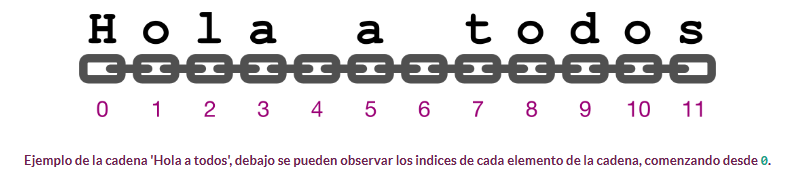

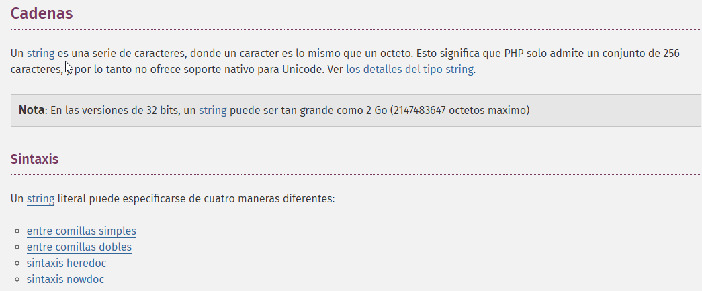

    En PHP las**[ cadenas de texto ](https://www.php.net/manual/es/language.types.string.php)**pueden usar tanto comillas **simples** como comillas  **dobles** . Sin embargo, hay una diferencia importante entre usar unas u otras.

* Cuando se pone una variable dentro de unas **comillas dobles**, se procesa y se sustituye por su valor. Así, el ejemplo anterior sobre el uso de **print** también
  podía haberse puesto de la siguiente forma:

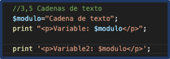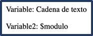

* La variable **$modulo** se reconoce dentro de las comillas dobles, y se sustituye.
* Con comillas simples, **no se realizaría sustitución alguna.**
* Cuando se usan **comillas simples**, sólo se realizan dos sustituciones dentro de la cadena: cuando se encuentra la secuencia de caracteres  **\'** , se muestra en la salida una comilla simple; y cuando se encuentra la secuencia  **\\** , se muestra en la salida una barra invertida.

#### Secuencias de escape

* Estas secuencias se conocen como  **secuencias de escape** .

  En las cadenas que usan comillas dobles, además de la secuencia  **\\** , se pueden usar algunas más, pero no la secuencia  **\'** . En esta tabla puedes ver las secuencias de escape que se pueden utilizar, y cuál es su resultado.

  Secuencias de escape

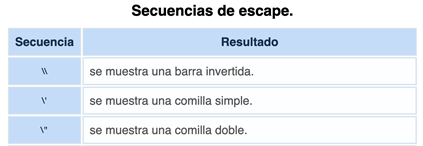

!!! info "Concatenación"

    En PHP tienes dos operadores exclusivos para trabajar con cadenas de texto. Con el operador de**concatenación punto (.)** puedes unir las dos cadenas de texto que le pases como operandos. El operador de **asignación y concatenación (.=)** concatena al argumento del lado izquierdo la cadena del lado derecho.

### Programa5_cadenas.php

!!! Success "Programa5_cadenas.php: Cadenas de texto (Ruta:**dwes/UD2/Entrega1**/)"

    Prueba a mostrar información con diferentes cadenas de texto. Para ello,**PERSONALIZA** el siguiente bloque de código y comenta brevemente **con tus palabras** y capturas las **funciones** utilizadas y su uso, puedes ayudarte del manual PHP. Lo debatiremos en clase.

* Comillas dobles → interpretan secuencias `\n`, `\t`, etc.
* Comillas simples → se muestran literales.
* Secuencias comunes (`\n`, `\t`, `\"`, `\\`, `\$`).
* Unicode y hexadecimales.
* `heredoc` y `nowdoc`.

```php
<!DOCTYPE html>
<html lang="es">
<head>
    <meta charset="UTF-8">
    <title>Cadenas y secuencias de escape en PHP</title>
    <style>
        body { font-family: Arial, sans-serif; padding:20px; line-height:1.5; }
        pre { background:#f4f4f4; padding:10px; border-radius:5px; }
        h2 { margin-top:25px; }
    </style>
</head>
<body>
    <h1>Estudio de cadenas y secuencias de escape en PHP</h1>

    <?php
        // Ejemplos con comillas dobles (interpreta escapes)
        $dobles = "Hola\nMundo\t(esto está tabulado)\nComilla doble: \"  Barra invertida: \\  Variable: \$valor";

        // Ejemplos con comillas simples (no interpreta escapes, salvo \' y \\)
        $simples = 'Hola\nMundo\t(esto aparece literal)\nComilla simple: \'  Barra invertida: \\  Variable: $valor';

        // Unicode y Hex
        $unicode = "Avión: \u{2708} (símbolo avión)";
        $hex     = "Códigos hexadecimales: \x41\x42\x43 = ABC";

        // Heredoc (interpreta escapes)
        $heredoc = <<<TEXT
Cadena con heredoc:
- Nueva línea \n (se interpreta)
- Tabulación \t (se interpreta)
- Variable \$unicode: $unicode
TEXT;

        // Nowdoc (no interpreta escapes)
        $nowdoc = <<<'TEXT'
Cadena con nowdoc:
- Nueva línea \n (literal)
- Tabulación \t (literal)
- Variable $unicode (no sustituida)
TEXT;
    ?>

    <h2>Con comillas dobles</h2>
    <pre><?php echo $dobles; ?></pre>

    <h2>Con comillas simples</h2>
    <pre><?php echo $simples; ?></pre>

    <h2>Unicode y Hex</h2>
    <pre><?php echo $unicode . "\n" . $hex; ?></pre>

    <h2>Heredoc</h2>
    <pre><?php echo $heredoc; ?></pre>

    <h2>Nowdoc</h2>
    <pre><?php echo $nowdoc; ?></pre>
</body>
</html>

```

---

# Comparativa:

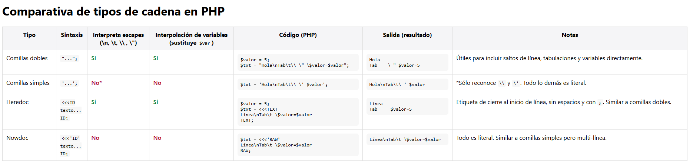

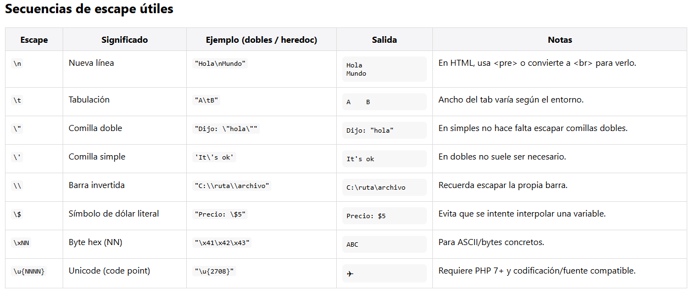

# Actividad Resumen

!!! success "Entregable"

    Tienes la info en la sección "[Actividad entregable](Entregable.md)"

# Presentaciones

Puedes acceder a las presentaciones **[desde la carpeta compartida](https://drive.google.com/drive/folders/1twOwx03LxI8LiezJ5Tmcb9BZosHsrI8i?usp=drive_link)**

# Referencias

* [PHP Documentation](https://www.php.net/manual/en/)
* [https://www.php.net/manual/es/]()
* [https://www.php.net/manual/es/language.basic-syntax.php]()
* [https://www.php.net/manual/es/function.echo.php]()
* [https://www.php.net/manual/es/language.types.php]()
* [Aitor Medrano](https://aitor-medrano.github.io/dwes2122/01arquitecturas.html)
