## UD 2 El lenguaje PHP. Básico 2

**Duración Estimada**: 8 sesiones, 16 horas

??? note "RA2 Escribe sentencias ejecutables por un servidor Web reconociendo y aplicando procedimientos de **integración del código en lenguajes de marcas**."

    > *  A Se han reconocido los mecanismos de generación de páginas Web a partir de lenguajes de marcas con código embebido.
    > *  B Se han identificado las principales tecnologías asociadas.
    > *  C Se han utilizado etiquetas para la inclusión de código en el lenguaje de marcas.
    > *  D Se ha reconocido la sintaxis del lenguaje de programación que se ha de utilizar.
    > *  E Se han escrito sentencias simples y se han comprobado sus efectos en el documento resultante.
    > *  F Se han utilizado directivas para modificar el comportamiento predeterminado.
    > *  G Se han utilizado los distintos tipos de variables y operadores disponibles en el lenguaje.
    > *  H Se han identificado los ámbitos de utilización de las variables.

??? note "RA3 Escribe bloques de sentencias embebidos en lenguajes de marcas, seleccionando y utilizando las **estructuras de programación**. "

    > *  A Se han utilizado mecanismos de**decisión** en la creación de bloques de sentencias.
    > *  B Se han utilizado **bucles** y se ha verificado su funcionamiento.
    > *  C Se han utilizado «**arrays**» para almacenar y recuperar conjuntos de datos.
    > *  D Se han creado y utilizado **funciones**.
    > *  E Se han utilizado **formularios** Web para interactuar con el usuario del navegador Web.
    > *  F Se han empleado métodos para **recuperar** la información introducida en el formulario.
    > *  G Se han añadido **comentarios** al código

??? note "OBJETIVOS SEMANALES"

    Instalar Entorno PHP

    Crear y compartir Repositorio GitHub

    Primeros programas PHP y subir al repositorio


# 3 Tipos de datos: funciones y variables

!!! info "Estamos aprendiendo..."

    **RA3** : Escribe bloques de sentencias embebidos en lenguajes de marcas, seleccionando y utilizando las estructuras de programación. **C.Ev.****D** Se han creado y utilizado funciones.

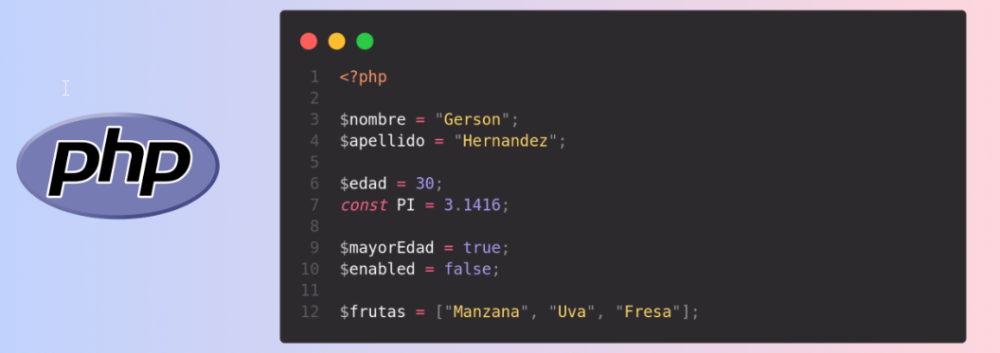

## 1. Isset, Unset y isnull

En PHP existen funciones específicas para comprobar y establecer el tipo de datos de una variable,

* **gettype** obtiene el tipo de la variable que se le pasa como parámetro y devuelve una cadena de texto, que puede ser
* **array, boolean, double, integer, object, string, null, resource o unknowntype.**

  También podemos comprobar si la variable es de un tipo concreto utilizando una de las siguientes funciones:
* > is_array(), is_bool(), is_float(), is_integer(), is_null(), is_numeric(), is_object(), is_resource(), is_scalar() e is_string().
  >

Devuelven **true** si la variable es del tipo indicado.

* Análogamente, para establecer el tipo de una variable utilizamos la función **settype** pasándole como parámetros la variable a convertir, y una de las siguientes cadenas:  **boolean** ,  **integer** ,  **float** ,  **string** ,  **array** , **object** o  **null** .
* La función **settype** devuelve true si la conversión se realizó correctamente, o false en caso contrario.
* isset: Si lo único que te interesa es saber si una variable está  definida y no es **null** , puedes usar la función  **isset** .
* La función **unset** destruye la variable o variables que se le pasa como parámetro

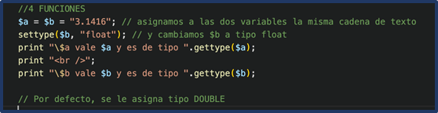

### 💻Programa6: Isset, Unset y isnull

!!! success "Programa6.php: Isset, Unset y isnull (Ruta:**dwes/UD2/Entrega1**/Programa6_isnull.php) "

    En este ejercicio trabajaremos con las funciones de**tipos de datos en PHP** .

Como verás, el programa 6:

1. Declara las siguientes variables:
   * Una cadena con el valor `"Hola mundo"`.
   * Un número entero con el valor `25`.
   * Un número decimal con el valor `12.34`.
   * Un array con los valores `avión, helicóptero, dron`.
   * Una variable con valor `null`.
2. Muestra el **tipo de cada variable** utilizando la función `gettype()`.
3. Comprueba si las variables son de un tipo concreto utilizando al menos 5 de las siguientes funciones:
   * `is_array()`, `is_bool()`, `is_float()`, `is_integer()`, `is_null()`, `is_numeric()`, `is_object()`, `is_resource()`, `is_scalar()`, `is_string()`.
4. Convierte la variable decimal en cadena usando `settype()` y muestra antes y después el tipo de dato.
5. Comprueba si la variable entera está definida y no es `null` con `isset()`.
6. Elimina la variable entera con `unset()` y demuestra que ya no existe.
7. Modifica un poco algunas variables y realiza tus comprobaciones.
8. ¿Qué hace la última línea? `(isset($entero) ? "existe" : "no existe")`
9. Documenta tus conclusiones

```php
<?php
// Programa 6- Comprobación y conversión de tipos
/*
En este ejercicio trabajaremos con las funciones de  **tipos de datos en PHP** .

1. Declara las siguientes variables:
   * Una cadena con el valor `"Hola mundo"`.
   * Un número entero con el valor `25`.
   * Un número decimal con el valor `12.34`.
   * Un array con los valores `avión, helicóptero, dron`.
   * Una variable con valor `null`.
2. Muestra el **tipo de cada variable** utilizando la función `gettype()`.
3. Comprueba si las variables son de un tipo concreto utilizando al menos 5 de las siguientes funciones:
   * `is_array()`, `is_bool()`, `is_float()`, `is_integer()`, `is_null()`, `is_numeric()`, `is_object()`, `is_resource()`, `is_scalar()`, `is_string()`.
4. Convierte la variable decimal en cadena usando `settype()` y muestra antes y después el tipo de dato.
5. Comprueba si la variable entera está definida y no es `null` con `isset()`.
6. Elimina la variable entera con `unset()` y demuestra que ya no existe.
*/

// 1. Declaración de variables
$cadena = "Hola mundo";
$entero = 25;
$decimal = 12.34;
$lista = array("avión", "helicóptero", "dron");
$nulo = null;

// 2. Mostrar tipo con gettype
echo "Tipo de cadena: " . gettype(/* ... */) . "<br>";
echo "Tipo de entero: " . gettype(/* ... */) . "<br>";

// 3. Comprobaciones con is_...
if (is_string(/* ... */)) {
    echo "La variable es una cadena<br>";
}
if (is_array(/* ... */)) {
    echo "La variable es un array<br>";
}

// 4. Conversión con settype
echo "Antes de convertir: " . gettype($decimal) . "<br>";
settype($decimal, /* ... */);
echo "Después de convertir: " . gettype($decimal) . "<br>";

// 5. isset
if (isset(/* ... */)) {
    echo "La variable está definida y no es null<br>";
}

// 6. unset
unset(/* ... */);
echo "Después de unset: " . (isset($entero) ? "existe" : "no existe") . "<br>";

// 7 mostramos variable No definida
echo "<br>Mostramos variable no definida:$entero";  // Notice: Undefined variable: entero
?>

```

---

## 2. Evitar warning

Aunque a veces podemos querer que los errores y las advertencias (**warning**) sean mostradas en nuestro navegador, no es una buena práctica mostrarlas ante posibles vulnerabilidades del sistema.

* Para evitar el siguiente mensaje de error existen varias formas de hacerlo, tanto dentro de nuestro código como dentro del fichero de configuración **php.ini**

Enlace a [**“cómo ocultar warning en PHP”**](https://www.baulphp.com/como-ocultar-los-warning-notice-en-php/#Como_ocultar_los_warning,_notice_en_PHP)

Warning en el programa anterior:

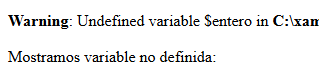

**Mostrar todos los warnings y errores**

```php
<?php
// Muestra todos los errores, incluidos los warnings
error_reporting(E_ALL);
ini_set('display_errors', 1);

echo $variableInexistente; // Warning: variable no definida
?>

```

**Ocultar Warning**

```php
<?php
// Oculta todos los warnings (aunque se sigan generando internamente)
error_reporting(0);// 7 mostramos variable No definida
echo "<br>Mostramos variable no definida:$entero";  // Notice: Undefined variable: entero
ini_set('display_errors', 0);

echo $variableInexistente; // No muestra nada en pantalla
?>

```

**Ocultar un warning concreto**

```
<?php
// El operador @ suprime el warning de esa instrucción concreta
$resultado = @file_get_contents("archivo_que_no_existe.txt");

if ($resultado === false) {
    echo "No se pudo leer el archivo.";
}
?>

```

* Lo recomendable es **mostrar los warnings en desarrollo** para detectar errores y **ocultarlos en producción** (registrándolos en un log con `error_log()`).
* `ini_set()` te deja **modificar parámetros de `php.ini` directamente desde el código** mientras el script se está ejecutando.
* *No todas las directivas se pueden modificar con `ini_set()` (algunas son `PHP_INI_SYSTEM` y solo se cambian en `php.ini` o en el servidor).*

### 💻Programa6: amplia para ocultar el warning generado

!!! success "Programa6.php: Isset, Unset y isnull (Ruta:**dwes/UD2/Entrega1**/Programa6_isnull.php) "

    Completa el Programa 6 para mostrar/ocultar los warnings y anota diferencia

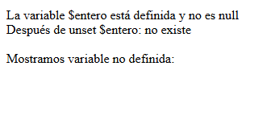

---

## 3. Constantes y constantes predefinidas

En PHP hay **dos formas principales** de definir una constante:

### 1. Con `const`

Se usa **fuera de funciones, clases o bucles** (a nivel global o dentro de clases).

```php
<?php
const EQUIPO = "Los Tigres";
const AFORO = 50000;

echo EQUIPO; // Muestra: Los Tigres
echo AFORO;  // Muestra: 50000
```

### 2. Con `define()`

Puede usarse en **cualquier parte del código** (funciones, condicionales, etc.).

```php
<?php
define("DEPORTE", "Fútbol");
define("ESTADIO", "Gran Arena");

echo DEPORTE; // Muestra: Fútbol
echo ESTADIO; // Muestra: Gran Arena
```

⚠️ Diferencias rápidas:

* `const` → más rápido, recomendado para constantes que conoces desde el principio.
* `define()` → más flexible, se puede usar en tiempo de ejecución.

Con la función  **define** puedes definir constantes:

* *bool **define** ( string $identificador , mixed $$case_insensitive = false ] );*

Los identificadores **no van precedidos por el signo "$"** y suelen escribirse en MAYÚSCULAS, aunque existe un tercer parámetro
opcional, que si vale true hace que se reconozca el identificador
independientemente de si está escrito en mayúsculas o en minúsculas

!!! alert "TiposDatos"

    Sólo se permiten los siguientes tipos de valores para las constantes:**integer,** **float** ,  **string** , **boolean** y  **null** .

El caso insensitivo genera error desde PHP 7.3 [https://www.php.net/manual/en/function.define.php](https://www.php.net/manual/en/function.define.php)

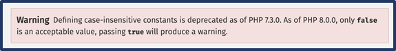

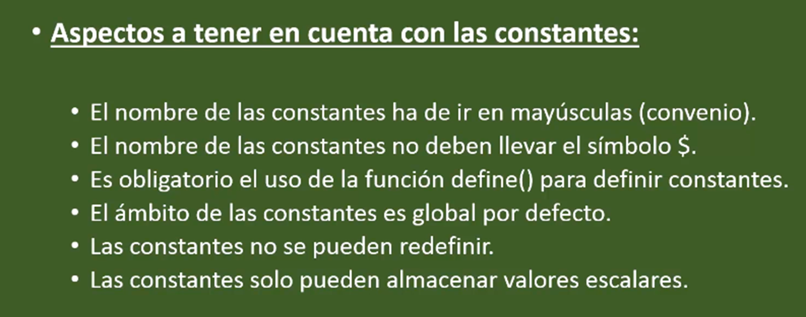

### Constantes predefinidas por PHP

[https://www.php.net/manual/es/language.constants.predefined.php](https://www.php.net/manual/es/language.constants.predefined.php)

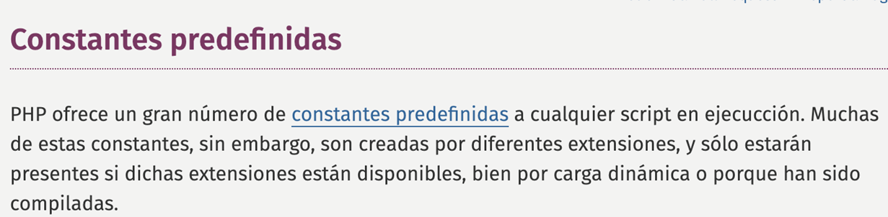

### 💻 Programa7: constantes

!!! success "Programa7_constantes.php (Ruta:**dwes/UD2/Entrega1**/Programa7_constantes.php) "

    Lee el**[siguiente artículo (enlace)](https://www.mclibre.org/consultar/php/lecciones/php-constantes.html)** y crea un scripts con diferentes bloques de php estudiando el uso de las constantes y predefinidas,

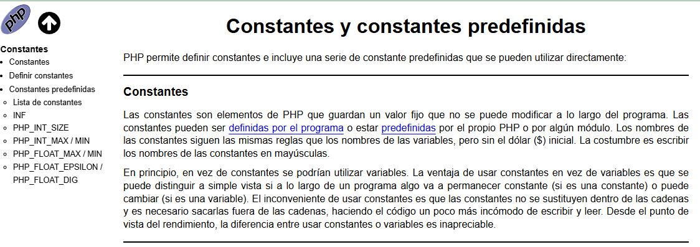

### 💻 Programa8: constantes

!!! success "Programa8_constantes.php (Ruta:**dwes/UD2/Entrega1**/Programa8_constantes.php) "

    Copia el siguiente programa que contiene una tabla con constantes y variables, ejecútalo y analiza en tu readme los elementos más importantes. Personalizalo y amplía lo que consideres.

    La sintaxis**`<?= ... ?>`** en PHP es un  **atajo para `<?php echo ... ?>`** .

```php
<?php
// --- Constantes propias ---
const DEPORTE = "Fútbol";
const EQUIPO  = "Los Tigres";
const ESTADIO = "Gran Arena";
const AFORO   = 50000;

// --- Constantes predefinidas de PHP ---
$constantes_php = [
    "PHP_VERSION" => PHP_VERSION,
    "PHP_OS"      => PHP_OS,
    "__FILE__"    => __FILE__,
];

// --- Constantes propias en array para analizarlas ---
$constantes_propias = [
    "DEPORTE" => DEPORTE,
    "EQUIPO"  => EQUIPO,
    "ESTADIO" => ESTADIO,
    "AFORO"   => AFORO,
];

// --- Variables de ejemplo ---
$jugadores = ["Pedro", "Juan", "Luis"]; // array
$goles     = 3;                          // entero
$capitan   = "Carlos";                   // string
$esLocal   = true;                       // booleano
?>
<!DOCTYPE html>
<html lang="es">
<head>
  <meta charset="UTF-8">
  <title><?= EQUIPO ?> - <?= DEPORTE ?></title>
  <style>
    table { border-collapse: collapse; margin: 1em 0; }
    th, td { border: 1px solid #999; padding: .4em .8em; }
    th { background: #eee; }
  </style>
</head>
<body>
  <h1><?= EQUIPO ?> (<?= DEPORTE ?>)</h1>
  <p>Estadio: <strong><?= ESTADIO ?></strong></p>
  <p>Aforo máximo: <strong><?= AFORO ?></strong> espectadores</p>

  <h2>Constantes de PHP</h2>
  <table>
    <tr>
      <th>Nombre</th><th>Valor</th><th>gettype</th><th>is_string</th><th>is_int</th>
    </tr>
    <?php foreach ($constantes_php as $nombre => $valor): ?>
    <tr>
      <td><?= $nombre ?></td>
      <td><?= $valor ?></td>
      <td><?= gettype($valor) ?></td>
      <td><?= is_string($valor) ? "sí" : "no" ?></td>
      <td><?= is_int($valor) ? "sí" : "no" ?></td>
    </tr>
    <?php endforeach; ?>
  </table>

  <h2>Constantes propias</h2>
  <table>
    <tr>
      <th>Nombre</th><th>Valor</th><th>gettype</th><th>is_string</th><th>is_int</th>
    </tr>
    <?php foreach ($constantes_propias as $nombre => $valor): ?>
    <tr>
      <td><?= $nombre ?></td>
      <td><?= $valor ?></td>
      <td><?= gettype($valor) ?></td>
      <td><?= is_string($valor) ? "sí" : "no" ?></td>
      <td><?= is_int($valor) ? "sí" : "no" ?></td>
    </tr>
    <?php endforeach; ?>
  </table>

  <h2>Variables de ejemplo</h2>
  <table>
    <tr>
      <th>Nombre</th><th>Valor</th><th>gettype</th><th>is_array</th><th>is_integer</th><th>is_string</th><th>is_bool</th>
    </tr>
    <tr>
      <td>$jugadores</td>
      <td><?= implode(", ", $jugadores) ?></td>
      <td><?= gettype($jugadores) ?></td>
      <td><?= is_array($jugadores) ? "sí" : "no" ?></td>
      <td><?= is_integer($jugadores) ? "sí" : "no" ?></td>
      <td><?= is_string($jugadores) ? "sí" : "no" ?></td>
      <td><?= is_bool($jugadores) ? "sí" : "no" ?></td>
    </tr>
    <tr>
      <td>$goles</td>
      <td><?= $goles ?></td>
      <td><?= gettype($goles) ?></td>
      <td><?= is_array($goles) ? "sí" : "no" ?></td>
      <td><?= is_integer($goles) ? "sí" : "no" ?></td>
      <td><?= is_string($goles) ? "sí" : "no" ?></td>
      <td><?= is_bool($goles) ? "sí" : "no" ?></td>
    </tr>
    <tr>
      <td>$capitan</td>
      <td><?= $capitan ?></td>
      <td><?= gettype($capitan) ?></td>
      <td><?= is_array($capitan) ? "sí" : "no" ?></td>
      <td><?= is_integer($capitan) ? "sí" : "no" ?></td>
      <td><?= is_string($capitan) ? "sí" : "no" ?></td>
      <td><?= is_bool($capitan) ? "sí" : "no" ?></td>
    </tr>
    <tr>
      <td>$esLocal</td>
      <td><?= $esLocal ? "true" : "false" ?></td>
      <td><?= gettype($esLocal) ?></td>
      <td><?= is_array($esLocal) ? "sí" : "no" ?></td>
      <td><?= is_integer($esLocal) ? "sí" : "no" ?></td>
      <td><?= is_string($esLocal) ? "sí" : "no" ?></td>
      <td><?= is_bool($esLocal) ? "sí" : "no" ?></td>
    </tr>
  </table>
</body>
</html>

  
```

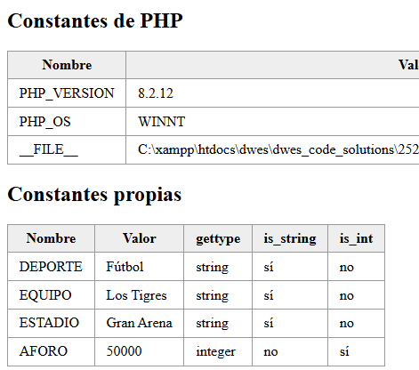

---

## 4 Fechas y horas

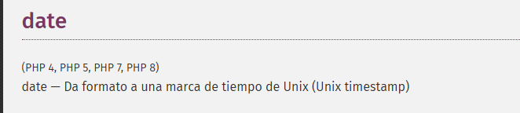

En PHP **no existe un tipo de datos** específico para trabajar con fechas y horas **[(enlace](https://www.php.net/manual/es/function.date.php)**).

* La información de fecha y hora se almacena internamente como un  **número entero** .
* Sin embargo, dentro de las **funciones** de PHP tienes a tu disposición unas cuantas para trabajar con ese tipo de datos.
* Devuelve una **cadena formateada** según el formato indicado usando el integer `timestamp` (Unix timestamp) dado, o el momento actual si no se da una marca de tiempo.
* En otras palabras, `timestamp` es opcional y por defecto es el valor de [time()](https://www.php.net/manual/es/function.time.php).

Una de las más útiles es quizás la función  **date** , que te permite obtener una cadena de texto a partir de una fecha y hora, con el formato que tú elijas.

* La función recibe dos parámetros, la **descripción** del formato y el número entero que identifica la fecha, y devuelve una cadena de texto formateada.

  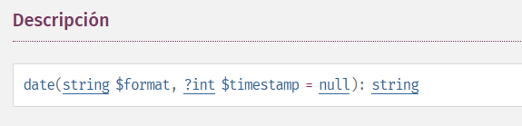

El **formato** lo debes componer utilizando como base una serie de caracteres de los que figuran en la siguiente tabla.

| **Carácter** | **Resultado**                                                           |
| ------------------- | ----------------------------------------------------------------------------- |
| **d**         | día del mes con dos dígitos.                                                |
| **j**         | día del mes con uno o dos dígitos ( sin ceros iniciales ).                 |
| **z**         | día del año, comenzando por el cero ( 0 = 1 de enero ).                    |
| **N**         | día de la semana ( 1 = lunes, ..., 7 = domingo )                            |
| **w**         | día de la semana ( 0 = domingo, ..., 6 =sábado ).                           |
| **l**         | texto del día de la semana, en inglés ( Monday, ..., Sunday ).             |
| **D**         | texto del día de la semana, solo tres letras, en inglés ( Mon, ..., Sun ). |
| **W**         | número de la semana del año.                                                |
| **m**         | número del mes con dos dígitos.                                             |
| **n**         | número del mes con uno o dos dígitos ( sin ceros iniciales ).              |
| **t**         | número de días que tiene el mes.                                            |
| **F**         | texto del día del mes, en inglés ( January, ..., December ).               |
| **M**         | texto del día del mes, solo tres letras, en inglés ( Jan, ..., Dec ).      |
| **Y**         | número del año.                                                             |
| **y**         | dos últimos dígitos del número del año.                                   |
| **L**         | 1 si el año es bisiesto, 0 si no lo es.                                      |

| h           | formato de 12 horas, siempre con dos dígitos                       |
| ----------- | ------------------------------------------------------------------- |
| **H** | formato de 24 horas, siempre con dos dígitos                       |
| **g** | formato de 12 horas, con uno o dos dígitos (sin ceros iniciales ). |
| **G** | formato de 24 horas, con uno o dos dígitos (sin ceros iniciales ). |
| **a** | am o pm, en minúsculas.                                            |
| **A** | AM o PM, en mayúsculas.                                            |
| **r** | fecha entera con formato RFC 2822.                                  |

Además, el segundo
parámetro es opcional. Si no se indica, **se utilizará la hora actual** para crear la cadena de texto.

Para que el sistema pueda darte información sobre tu fecha y hora, debes indicarle tu zona horaria.
Puedes hacerlo con la función  **date_default_timezone_set** . Para
establecer la zona horaria en España peninsular debes indicar:

!!! alert  "Zona horaria"

    **date_default_timezone_set('Europe/Madrid');**

    Si utilizas alguna función de fecha y hora sin haber establecido previamente tu zona horaria, lo más probable es que recibas un error o mensaje de advertencia de PHP indicándolo

Otras funciones
como **getdate** devuelven
un array con información sobre la fecha y hora actual.

* En la documentación
  de PHP puedes consultar todas las funciones para gestionar fechas y horas: [https://www.php.net/manual/en/ref.datetime.php](https://www.php.net/manual/en/ref.datetime.php)

### 💻 Programa9_date

!!! success "Programa9_date.php (Ruta:**dwes/UD2/Entrega1**/Programa9_date.php) "

    Pídele a la IA un pequeño programa que muestre el uso más comun de la función**date, getdate y** las funciones vistas en este punto, muestra con al menos 7-8 formatos diferentes.

    Estúdialo y adáptalo para anotar lo más importante en tu README, con tus palabras y no Copy/Paste, please.

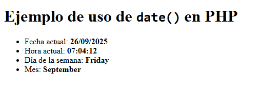

---

## 5. Variables Especiales de PHP (superglobals)

En la unidad anterior ya aprendiste qué eran y cómo se utilizaban las variables globales. PHP incluye unas cuantas **variables internas** predefinidas que pueden usarse desde
cualquier ámbito, por lo que reciben el nombre de  **variables superglobales** .

* Ni siquiera es necesario que uses **global** para acceder a ellas.

Cada una de estas variables es un **array** que contiene un conjunto de valores (en esta unidad veremos más adelante cómo se pueden utilizar los arrays). Las variables superglobales disponibles en PHP son las siguientes:

* **$_SERVER** .
  Contiene información sobre el entorno del servidor web y de ejecución. Entre la
  información que nos ofrece esta variable, tenemos:

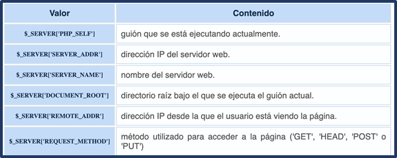

* En la documentación de PHP puedes consultar toda la
  información que ofrece  **$_SERVER** : [https://www.php.net/manual/es/reserved.variables.server.php](https://www.php.net/manual/es/reserved.variables.server.php)

**_GET, _POST** y **$_COOKIE** contienen las variables que
se han pasado al script actual utilizando respectivamente los métodos GET
(parámetros en la URL), HTTP POST y Cookies HTTP.

**$_REQUEST** junta en uno solo el contenido de los tres
arrays anteriores,  **$_GET** , **$_POST** y  **$_COOKIE** .

**$_ENV** contiene las variables que se puedan haber
pasado a PHP desde el entorno en que se ejecuta.

**$_FILES** contiene los ficheros que se puedan haber
subido al servidor utilizando el método POST.

**$_SESSION** contiene las variables de sesión disponibles
para el guión actual.

En
posteriores unidades iremos trabajando con estas variables.

??? alert  "Importante"

    Conviene tener a mano la información sobre estas variables superglobales disponible en el manual de PHP.

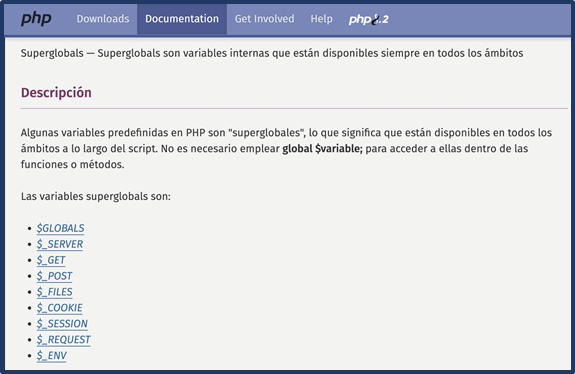

[https://www.php.net/manual/es/language.variables.superglobals.php](https://www.php.net/manual/es/language.variables.superglobals.php)

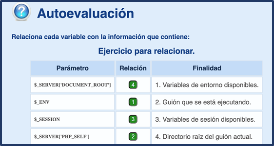

En el siguiente programa, vamos a trabajar con estas **superglobales**:

* `$_SERVER`
* `$_GET`
* `$_POST`
* `$_REQUEST`
* `$_FILES`
* `$_ENV`
* `$_GLOBALS`
* `$_COOKIE` (se mostrará vacía si no hay cookies, pero no la definimos)
* `$_SESSION` (vacía si no se inicia, pero la listamos)
* `$_FILES`

### 💻 Programa10: superglobal

!!! success "Programa10_superglobal.php (Ruta:**dwes/UD2/Entrega1**/Programa10_superglobal.php) "

    Vamos a completar los huecos para mostrar algunas**variables superglobales** con la función **print_r** que pinta un array.

**Programa10.php** (para completar)**:**

```php
<!DOCTYPE html>
<html lang="es">
<head>
  <meta charset="UTF-8">
  <title>Ejemplo Superglobales PHP</title>
</head>
<body>
  <h1>Ejemplo de Superglobales en PHP</h1>

  <h2>1. $_SERVER</h2>
  <pre><?php print_r( _______ ); ?></pre> <!-- HUECO 1 -->

  <h2>2. $_GET</h2>
  <form method="get">
      <label>Nombre (GET): <input type="text" name="nombre"></label>
      <input type="submit" value="Enviar GET">
  </form>
  <pre><?php print_r( _______ ); ?></pre> <!-- HUECO 2 -->

  <h2>3. $_POST</h2>
  <form method="post">
      <label>Edad (POST): <input type="number" name="edad"></label>
      <input type="submit" value="Enviar POST">
  </form>
  <pre><?php print_r( _______ ); ?></pre> <!-- HUECO 3 -->

  <h2>4. $_REQUEST</h2>
  <pre><?php print_r( _______ ); ?></pre> <!-- HUECO 4 -->

  <h2>5. $_FILES</h2>
  <form method="post" enctype="multipart/form-data">
      <label>Subir archivo: <input type="file" name="archivo"></label>
      <input type="submit" value="Enviar Archivo">
  </form>
  <pre><?php print_r( _______ ); ?></pre> <!-- HUECO 5 -->

  <h2>6. $_ENV</h2>
  <pre><?php print_r( _______ ); ?></pre> <!-- HUECO 6 -->

  <h2>7. $_GLOBALS</h2>
  <pre><?php print_r( _______ ); ?></pre> <!-- HUECO 7 -->

  <h2>8. $_COOKIE</h2>
  <pre><?php print_r( _______ ); ?></pre> <!-- HUECO 8 -->

  <h2>9. $_SESSION</h2>
  <pre><?php print_r( _______ ); ?></pre> <!-- HUECO 9 -->

</body>
</html>
```

* **Ejecuta los códigos de formulario para comprobar resultados:**

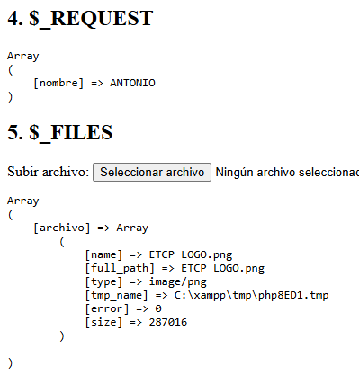

---

# 📝 Actividad ==Entregable==

!!! success "==Entregable=="

    Tienes la info en la sección "[Actividad ==entregable==](Entregable1.md)"

# 📘Referencias

[PHP Documentation](https://www.php.net/manual/en/)

    [https://www.php.net/manual/es/]()

    [https://www.php.net/manual/es/language.basic-syntax.php]()

    [https://www.php.net/manual/es/function.echo.php]()

    [https://www.php.net/manual/es/language.types.php]()

[Aitor Medrano](https://aitor-medrano.github.io/dwes2122/01arquitecturas.html)

# Presentación
