## UD 2 El lenguaje PHP. 4 Estructuras de Control

**Duración Estimada**: 8 sesiones, 16 horas

??? note "RA2 Escribe sentencias ejecutables por un servidor Web reconociendo y aplicando procedimientos de **integración del código en lenguajes de marcas**."

    > *  A Se han reconocido los mecanismos de generación de páginas Web a partir de lenguajes de marcas con código embebido.
    > *  B Se han identificado las principales tecnologías asociadas.
    > *  C Se han utilizado etiquetas para la inclusión de código en el lenguaje de marcas.
    > *  D Se ha reconocido la sintaxis del lenguaje de programación que se ha de utilizar.
    > *  E Se han escrito sentencias simples y se han comprobado sus efectos en el documento resultante.
    > *  F Se han utilizado directivas para modificar el comportamiento predeterminado.
    > *  G Se han utilizado los distintos tipos de variables y operadores disponibles en el lenguaje.
    > *  H Se han identificado los ámbitos de utilización de las variables.

!!! note "RA3 Escribe bloques de sentencias embebidos en lenguajes de marcas, seleccionando y utilizando las **estructuras de programación**. "

    > *  A Se han utilizado mecanismos de**decisión** en la creación de bloques de sentencias.
    > *  B Se han utilizado **bucles** y se ha verificado su funcionamiento.
    > *  C Se han utilizado «**arrays**» para almacenar y recuperar conjuntos de datos.
    > *  D Se han creado y utilizado **funciones**.
    > *  E Se han utilizado **formularios** Web para interactuar con el usuario del navegador Web.
    > *  F Se han empleado métodos para **recuperar** la información introducida en el formulario.
    > *  G Se han añadido **comentarios** al código

!!! note "OBJETIVOS Entrega 2"

    Estructuras de control, Creación de funciones y formularios

## Introducción

En la clase anterior estudiamos cómo mostrar datos por pantalla y algunas de las funciones de php para tratar tipos, constantes, variables superglobales. En la clase de hoy, veremos **bucles, condicionales y otras estructuras de control** del flujo.

# Estructuras de control

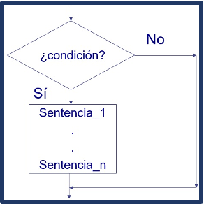

Para definir el flujo de un programa en PHP, al igual que en la mayoría de lenguajes de programación, hay sentencias para dos tipos de  **estructuras de control** :

* **sentencias condicionales** , que permiten definir las condiciones bajo las que debe ejecutarse una sentencia o un bloque de sentencias; y
* **sentencias de bucle** , con las que puedes definir si una sentencia o conjunto de sentencias se repite o no, y bajo qué condiciones.

## 1. Condicionales

### **1.1 if / elseif / else** .

La sentencia **if** permite definir una expresión para ejecutar o no la sentencia o conjunto de sentencias siguiente.

* Si la expresión se evalúa a **true** (verdadero), la sentencia se ejecuta.
* Si se evalúa a **false** (falso), no se ejecutará.

Cuando el resultado de la expresión sea false, puedes utilizar **else** para indicar una sentencia o grupo de sentencias a ejecutar en ese caso.

* Otra alternativa a **else** es utilizar **elseif** y escribir una nueva expresión que comenzará un nuevo condicional.

Cuando, como sucede en el ejemplo, la sentencia if, elseif o else actúe sobre **una única sentencia**, no será necesario usar llaves.

Tendrás que usar **llaves** para formar un conjunto de sentencias siempre que quieras que el condicional actúe sobre más de una sentencia.

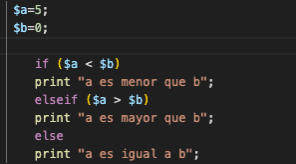

### 💻Programa11: If, else, elseif

!!! success "Programa11.php: Isset, Unset y isnull (Ruta:**dwes/UD2/Entrega2**/Programa11_if.php) "

    Vamos a probar un poco siguiendo el[ manual de php](https://www.php.net/manual/es/control-structures.if.php): lee el artículo de la documentación php y configura algunos bloques de condicionales con if, else y elseif que vienen en los ejemplos, comprende también la **sintáxis alternativa** con un ejemplo

    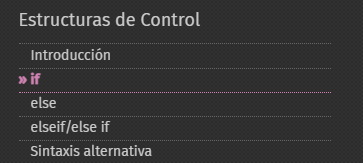

---

### 1.2 Switch

 **switch** . La sentencia **switch** es similar
a enlazar varias sentencias **if** comparando una misma variable
con diferentes valores.

* Cada valor va en una sentencia  **case** .
* Cuando se encuentra una coincidencia, comienzan a
  ejecutarse las sentencias siguientes hasta que acaba el bloque  **switch** ,
  o hasta que se encuentra una sentencia  **break** .
* Si no existe coincidencia con el valor de
  ningún  **case** , se ejecutan las sentencias del bloque  **default** ,
  en caso de que exista.

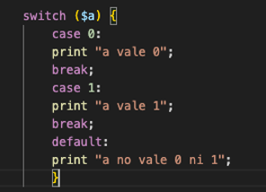

### 💻Programa12: Switch

!!! success "Programa12.php: Switch (Ruta:**dwes/UD2/Entrega2**/Programa12_Switch.php) "

    Corrije este código desordenado con la estructura de switch. Fíjate en el de arriba

```php
<?php

echo "Otro día";

switch ($dia) 
    case 1:
        echo "Lunes";
        break;

    case 3:
        echo "Miércoles";
        break;

  
        break;
} {

        case 2:
        echo "Martes";
        break;

$dia = 3;   // Cambia este valor para probar
    default:
?>

```

### 1. 3 Match (PHP 8)

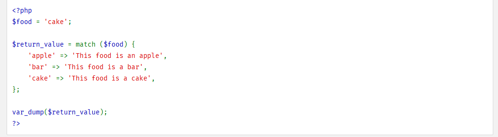

La expresión `match` ramifica la evaluación basada en una **comprobación de identidad de un valor.**

* De forma similar a una sentencia `switch`, una expresión `match` tiene una expresión de sujeto que se compara con múltiples alternativas.
* A diferencia de `switch`, se evaluará a un valor muy parecido al de las expresiones ternarias.
* A diferencia de `switch`, la comparación es una **comprobación de identidad** (`===`) en lugar de una comprobación de igualdad débil (`==`).
* Las expresiones match están disponibles a partir de **PHP 8.0.0.**

[**https://www.php.net/manual/es/control-structures.match.php**]([https://www.php.net/manual/es/control-structures.match.php]())

Ejemplo

```
<?php
$videojuego = "Zelda";

$genero = match($videojuego) {
    "FIFA" => "Deportes",
    "Call of Duty" => "Shooter",
    "Zelda" => "Aventura",
    "Minecraft" => "Sandbox",
    default => "Género desconocido",
};

echo "El juego $videojuego pertenece al género: $genero";
?>

```

### 💻Programa13: Match

!!! success "Programa12.php: Switch (Ruta:**dwes/UD2/Entrega2**/Programa13_match.php) "

    Comenta un poco la estructura match en tu readme y crea el programa usando y adaptando los ejemplos anteriores.

    **Busca y documenta** en qué ocasiones puede ser útil

---

## 2. Bucles

### 2.1 While / Do While / For

Existen diferentes tipos de bucles en PHP:

·       **while:** Usando **while** puedes definir un bucle que se ejecuta
mientras se cumpla una expresión. La expresión se evalúa antes de comenzar cada
ejecución del bucle.

·       **do / while:** Es un bucle similar al anterior, pero la expresión se evalúa al final, con lo cual se
asegura que la sentencia o conjunto de sentencias del bucle se ejecutan al
menos una vez.

·       **for :** Son los bucles más complejos de PHP. Al igual que los del lenguaje C,
se componen de tres expresiones:

`for (expr1; expr2; expr3)`

o
La primera
expresión,  **expr1** , se ejecuta solo una vez al **comienzo** del bucle.

o
La segunda
expresión,  **expr2** , se evalúa para saber si se debe ejecutar o no la
sentencia o conjunto de sentencias. Si el resultado el **false**, el bucle termina.

o
Si el
resultado es true, se ejecutan las sentencias y al finalizar se ejecuta la
tercera expresión,  **expr3** , y se vuelve a evaluar **expr2** para
decidir si se vuelve a ejecutar o no el bucle.

·       Puedes anidar cualquiera de los bucles anteriores
en varios niveles.
También puedes usar las sentencias  **break** , para salir del bucle,
y  **continue** , para omitir la ejecución de las sentencias restantes y
volver a la comprobación de la expresión respectivamente.

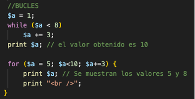

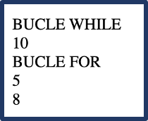

### 💻Programa14: loops

!!! success "Programa14.php: Switch (Ruta:**dwes/UD2/Entrega2**/Programa14_loops.php) "

    Completa el script**Programa14.php** y sustituye el valor **???** para que:

1. Use un **bucle for** para mostrar los números del 1 al 5.
2. Use un **bucle while** para mostrar los números pares del 2 al 10.
3. Use un **bucle do...while** para mostrar la cuenta atrás desde 5 hasta 1.
4. Realiza captura con el resultado y después amplía el código mostrando hasta y desde el 50

```php
<?php
// Programa14.php
echo "<h3>Ejemplo con for</h3>";
for ($i = 1; $i <= ???; $i???) {
    echo "Número: $i <br>";
}

echo "<h3>Ejemplo con while</h3>";
$j = 2;
??? ($j <= 10) {
    echo "Par: $j <br>";
    $j ??? 2;
}

echo "<h3>Ejemplo con do...while</h3>";
$k = 5;
???{
    echo "Cuenta atrás: $k <br>";
    ??? ;
} while ($k >= ???);
?>

```

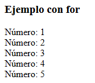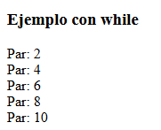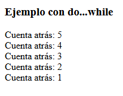

---

### 2.2 Foreach (arrays & objetos)

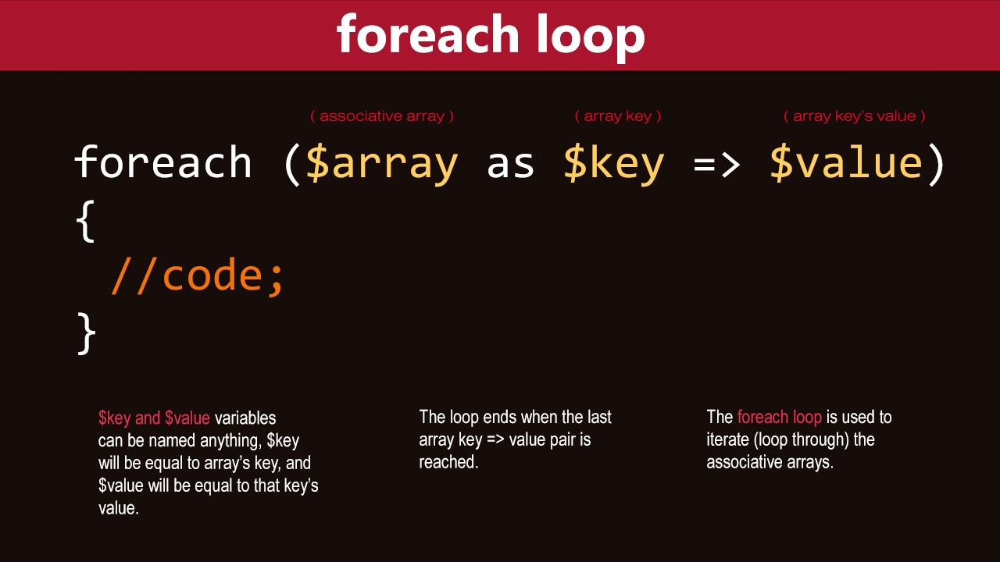

<iframe width="288" height="512" src="https://www.youtube.com/embed/a8GGar3gPE8" title="PHP foreach Loop Example #shorts #foreach #loop #tutorials #coding" frameborder="0" allow="accelerometer; autoplay; clipboard-write; encrypted-media; gyroscope; picture-in-picture; web-share" referrerpolicy="strict-origin-when-cross-origin" allowfullscreen></iframe>

El constructor `foreach` proporciona un modo sencillo de **iterar sobre arrays.**

`foreach` funciona sólo sobre arrays y objetos, y emitirá un error al intentar usarlo con una variable de un tipo diferente de datos o una variable no inicializada.

* Existen **dos sintaxis:**

`foreach (expresión_array as $valor)     `

    `sentencias `

`foreach (expresión_array as $clave => $valor)     `

    `sentencias`

La **primera** forma recorre el array dado por `expresión_array`.

1. En cada iteración, el valor del elemento actual se asigna a `$valor` y
2. el puntero interno del array avanza una posición (así en la próxima iteración se estará observando el siguiente elemento).

La **segunda** forma además asigna la clave del elemento actual a la variable `$clave` en cada iteración.

También es posible [personalizar la iteración de objetos](https://www.php.net/manual/es/language.oop5.iterations.php).

[Enlace documentación Foreach](https://www.php.net/manual/es/control-structures.foreach.php)

### 💻Programa15: Foreach

!!! success "Programa15.php: Switch (Ruta:**dwes/UD2/Entrega2**/Programa15_Switch.php) "

    Prueba, analiza y documenta el siguiente script.

    Una vez que lo entiendas, imprime con foreach la variable superglobal $**_SERVER** para que aparezca en negrita los valores **CLAVE/VALOR**

```php
<?php
// Array simple de videojuegos
$videojuegos = ["Zelda", "FIFA", "Minecraft", "Call of Duty"];

// --- Foreach en su forma simple (solo valores)
echo "<h3>Lo mostramos con print_r()</h3>";
print_r($videojuegos);
echo "<br>";

echo "<h3>Recorrido simple con foreach</h3><br>";
foreach ($videojuegos as $juego) {
    echo "Juego: $juego <br>";
}

// --- Foreach con clave => valor
echo "<h3>Recorrido con FOREACH clave => valor</h3>";
foreach ($videojuegos as $indice => $juego) {
    echo "Índice $indice => $juego <br>";
}

// --- Matriz bidimensional: videojuegos con género
$listaJuegos = [
    ["nombre" => "Zelda", "genero" => "Aventura"],
    ["nombre" => "FIFA", "genero" => "Deportes"],
    ["nombre" => "Minecraft", "genero" => "Sandbox"],
    ["nombre" => "Call of Duty", "genero" => "Shooter"]
];

echo "<h2>Matriz bidimensional</h2>";
echo "<h3>Lo mostramos con print_r()</h3>";
print_r($listaJuegos);
echo "<br>";
echo "<h3>Recorrido de matriz bidimensional</h3>";
foreach ($listaJuegos as $item) {
    echo "El juego {$item['nombre']} es de género {$item['genero']} <br>";
}
?>

```

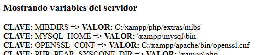

   Si te da tiempo, analiza también y amplía con los siguientes ejemplos el script anterior

```php
php
/* Ejemplo 3 de foreach: clave y valor */

$a = array(
    "uno" => 1,
    "dos" => 2,
    "tres" => 3,
    "diecisiete" => 17
);

foreach ($a as $k => $v) {
    echo "\$a[$k] => $v.\n";
}

/* Ejemplo 4 de foreach: arrays multidimensionales */
$a = array();
$a[0][0] = "a";
$a[0][1] = "b";
$a[1][0] = "y";
$a[1][1] = "z";

foreach ($a as $v1) {
    foreach ($v1 as $v2) {
        echo "$v2\n";
    }
}
```

# Actividad Entregable

!!! success "Entregable"

    Tienes la info en la sección "[Actividad entregable](Entregable.md)"
