#### UD 2 El lenguaje PHP. 5 Funciones

**Duración Estimada**: 8 sesiones, 16 horas

??? note "RA2 Escribe sentencias ejecutables por un servidor Web reconociendo y aplicando procedimientos de **integración del código en lenguajes de marcas**."

    > *  A Se han reconocido los mecanismos de generación de páginas Web a partir de lenguajes de marcas con código embebido.
    > *  B Se han identificado las principales tecnologías asociadas.
    > *  C Se han utilizado etiquetas para la inclusión de código en el lenguaje de marcas.
    > *  D Se ha reconocido la sintaxis del lenguaje de programación que se ha de utilizar.
    > *  E Se han escrito sentencias simples y se han comprobado sus efectos en el documento resultante.
    > *  F Se han utilizado directivas para modificar el comportamiento predeterminado.
    > *  G Se han utilizado los distintos tipos de variables y operadores disponibles en el lenguaje.
    > *  H Se han identificado los ámbitos de utilización de las variables.

!!! note "RA3 Escribe bloques de sentencias embebidos en lenguajes de marcas, seleccionando y utilizando las **estructuras de programación**. "

    > *  A Se han utilizado mecanismos de**decisión** en la creación de bloques de sentencias.
    > *  B Se han utilizado **bucles** y se ha verificado su funcionamiento.
    > *  C Se han utilizado «**arrays**» para almacenar y recuperar conjuntos de datos.
    > *  D Se han creado y utilizado **funciones**.
    > *  E Se han utilizado **formularios** Web para interactuar con el usuario del navegador Web.
    > *  F Se han empleado métodos para **recuperar** la información introducida en el formulario.
    > *  G Se han añadido **comentarios** al código

!!! note "OBJETIVOS Entrega 2"

    Estructuras de control, Creación de funciones y formularios

## Introducción

En la clase anterior estudiamos bucles, condicionales y otras estructuras de control del flujo. Hoy veremos Funciones y arrays.

# 1 Funciones

Cuando quieres repetir la ejecución de un bloque de código, puedes utilizar un bucle. Las **funciones** ([Manual PH](https://www.php.net/manual/es/functions.user-defined.php)P) tienen
una utilidad similar: **nos permiten asociar una etiqueta** (el nombre de la función) **con un bloque de código** a ejecutar.
Además, al usar funciones estamos ayudando a **estructurar** mejor el código.

* Como ya sabes, las funciones permiten crear **variables locales** que no serán visibles fuera del cuerpo de las mismas.

## 1.1 Creación y Ejecución de funciones. (function)

Ya sabes que, para hacer una **llamada** a una función, basta con poner su nombre y unos paréntesis: **phpinfo();**

Para crear tus propias funciones, deberás usar la palabra  **function** .

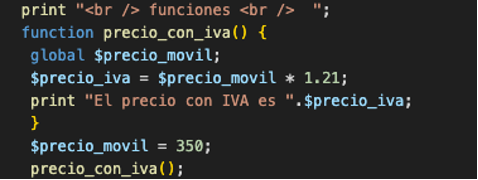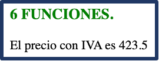

### 💻Programa16: Completa la función

!!! success "Programa16.php: Funciones (Ruta:**dwes/UD2/Entrega2**/Programa16_funcion.php) "

    Completa los tres huecos y comenta la siguiente función.

```php
<?php
// Función simple sin argumentos
function precioConIVA(): float {
    $????= 100;  // definido dentro de la función
    $iva = ????;      // definido dentro de la función
    $precioFinal = $precio + ($precio * $iva / 100);
    return round($precioFinal, 2);
}

// Ejemplo de uso
echo "Precio con IVA: " . ????() . " €<br>";
?>

```

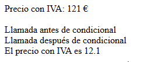

!!! info "tipo devuelto"

    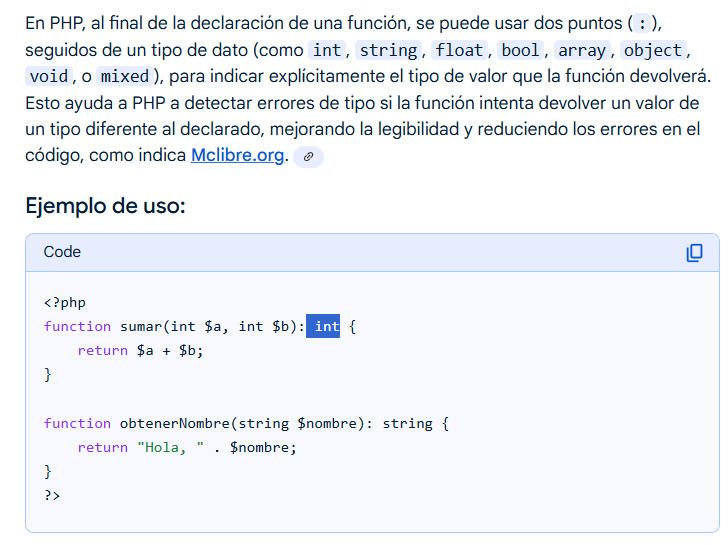

## 1.2 Funciones condicionales

En PHP no es necesario que definas una función antes de utilizarla, excepto cuando está condicionalmente definida como se muestra en el siguiente ejemplo:

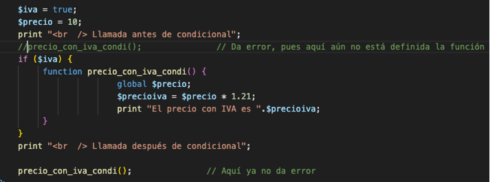

Cuando una función está definida de una **forma condicional** sus definiciones **deben ser procesadas** antes de ser llamadas.

* Por tanto, la definición de la función debe estar **antes** de cualquier llamada.

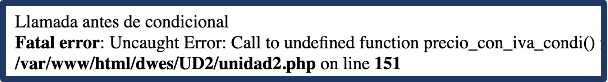

### 💻Programa16: Amplia tu programa

!!! success "Programa16.php: Funciones (Ruta:**dwes/UD2/Entrega2**/Programa16_funcion.php) "

    Amplía este programa para definir también una función IVA condicional

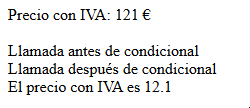

**Si controlamos el error:**

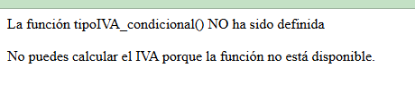

**Si la muestro de forma forzada:**

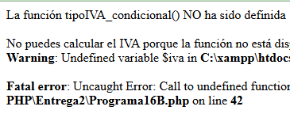

---

## 1.3 Argumentos

En el ejemplo anterior en la función usabas una variable  **global** , lo cual no es una buena práctica.

* Siempre es mejor utilizar **argumentos o parámetros** al hacer la llamada.
* Además, en lugar de mostrar el resultado en pantalla o guardar el resultado en una variable global, las
  funciones pueden devolver un valor usando la sentencia  **return** .
* Cuando en una función se encuentra una sentencia  **return** , termina su procesamiento y **devuelve** el valor que se indica.

Por tanto, puedes **reescribir** la función anterior de la siguiente forma:

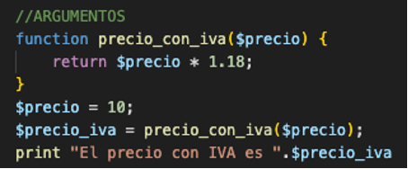

* Los argumentos se indican en la **definición**
  de la función como una lista de variables separada por comas.
* Se puse indicar o no el tipo de cada argumento

### 💻Programa17: Argumentos

!!! success "Programa17.php: Switch *(Ruta:**dwes/UD2/Entrega2/**)* "

    Completa la siguiente función que es igual que la 16 pero con argumentos

```php
<?php
function ???? (float ???? , float ???? ): float {
    // $precio → precio base
    // $iva    → porcentaje de IVA (por defecto 21%)
    $precioFinal = $precio + ($precio * $iva / 100);
    return round($precioFinal, 2); // Redondeamos a 2 decimales
}

// Ejemplo de uso
$precioBase = 100;
echo "Precio base: $precioBase €<br>";
echo "Precio con IVA (21%): " . precioConIVA($precioBase, 21) . " €<br>";
echo "Precio con IVA (10%): " . precioConIVA($precioBase, 10) . " €<br>";
?>
```

---

### Argumentos por defecto

Al definir la función, puedes indicar **valores por defecto** para los argumentos, de forma que cuando hagas una
llamada a la función puedes no indicar el valor de un argumento; en este caso se toma el valor por defecto indicado.

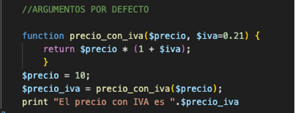

* Puede haber valores por defecto definidos para varios argumentos, pero en la lista de argumentos de la función todos ellos deben
  estar a la **derecha** de cualquier otro argumento sin valor por defecto.

### Argumentos por referencia (&)

En los ejemplos anteriores los argumentos se pasaban  **por valor** .

1. Esto es, cualquier cambio que se haga dentro de la función a los valores de los argumentos no se reflejará fuera
   de la función.
2. Si quieres que esto ocurra debes definir el parámetro para que
   su valor se pase  **por referencia** , añadiendo el símbolo **&** antes de su nombre.

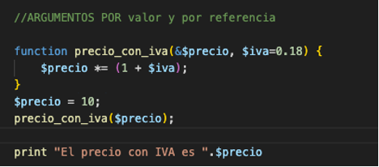

!!! info "Aritmética de Punteros"

    Nunca está demás conocer un poco acerca de[aritmética de punteros](https://es.wikipedia.org/wiki/Puntero_%28inform%C3%A1tica%29) que usan lenguajes de más bajo nivel

    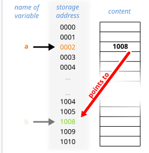

### 💻Programa18: Argumentos valor y referencia

!!! success "Programa18.php: Argumentos valor y referencia *(Ruta:**dwes/UD2/Entrega2/**)* "

    Completa el siguiente programa y modifica el valor de**IVA** por defecto

```

<?php
    print "<br/><br/>  ARGUMENTOS POR valor y por referencia <br  /> ";//ARGUMENTOS POR DEFECTO
    function precio_iva_referencia (&$precio /*le pasas su direcion de memoria 100325*/, $iva=0.21) {
        $precio *= (1 + $iva); 
        RETURN? 
    }

    $precio = 10;  //imagina que su MEMORY ADDRESS vale 100325
    print "<br/><br/>1- ANTES de llamar a la función:  El precio con IVA es ".$precio ;  //10

    precio_iva_referencia($precio);

    print "<br/>2- DESPUES de llamar a la función:  El precio con IVA es ". $precio ;  //121
    print "<br/><b>3- Anota en tus apuntes qué RETURN has usado</b>"

?>  
```

## Argumentos variables

* La sintaxis donde la función lleva tres puntos y el nombre del argumento `...$args` ,  `...$numeros` convierte todos los argumentos en un **array** dentro de la función
* También existen funciones como (`func_get_args()`) que veremos en el siguiente ejemplo
* Existen **dos enfoques** : el moderno con `...$args` y el clásico con `func_get_args()`

Lee el siguiente artículo:

!!! info "Argumentos fijos y variables"

    [Enlace artículo CodersFree](https://codersfree.com/posts/argumentos-fijos-y-argumentos-variables-de-una-funcion-php)

### 💻Programa18: Argumentos variables

!!! success "Programa18.php: Argumentos variables *(Ruta:**dwes/UD2/Entrega2/**)* "

    Amplía con un segundo bloque PHP y analiza el siguiente ejemplo en tu documentación, añade captura

```
<?php
// Versión moderna (PHP 5.6+)
function sumarModern(...$numeros) {
    $suma = 0;
    foreach ($numeros as $n) {
        $suma += $n;
    }
    return $suma;
}

// Versión clásica (PHP <5.6)
function sumarClasico() {
    $args = func_get_args(); // obtiene todos los argumentos como array
    $suma = 0;
    foreach ($args as $n) {
        $suma += $n;
    }
    return $suma;
}

// Ejemplos de uso
echo "Suma moderna (2 + 3): " . sumarModern(2, 3) . "<br>";
echo "Suma moderna (1 + 2 + 3 + 4 + 5): " . sumarModern(1, 2, 3, 4, 5) . "<br>";

echo "Suma clásica (2 + 3): " . sumarClasico(2, 3) . "<br>";
echo "Suma clásica (10 + 20 + 30): " . sumarClasico(10, 20, 30) . "<br>";
?>

```

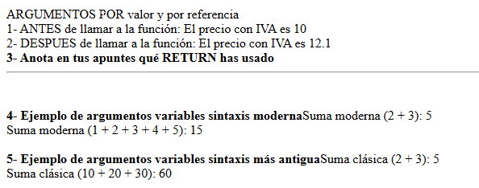

---

# 2. Inclusión de ficheros externos (include/require).

Conforme vayan creciendo los programas que hagas, verás que **resulta trabajoso** encontrar la información
que buscas dentro del código.

* En ocasiones resulta útil **agrupar ciertos grupos de funciones** o bloques de código, y ponerlos en un fichero aparte.
* Posteriormente, puedes **hacer referencia** a esos ficheros para que PHP incluya su contenido como
  parte del programa actual.

Para incorporar a tu programa contenido de un archivo externo, tienes varias posibilidades:

* **include** **:** Evalúa el
  contenido del fichero que se indica y lo incluye como parte del fichero
  actual, en el mismo punto en que se realiza la llamada. La ubicación del
  fichero puede especificarse utilizando una **ruta absoluta,** pero lo más
  usual es con una **ruta relativa**. En este caso, se toma como base la ruta
  que se especifica en la directiva **include_path** del
  fichero  **php.ini** . Si no se encuentra en esa ubicación, se
  buscará también en el directorio del script actual, y en el directorio de
  ejecución.
* **include_once:** Si por equivocación incluyes más de una
  vez un mismo fichero, lo normal es que obtengas algún tipo de error (por
  ejemplo, al repetir una definición de una función). **include_once** funciona
  exactamente igual que  **include** , pero solo incluye aquellos
  ficheros que aún no se hayan incluido.

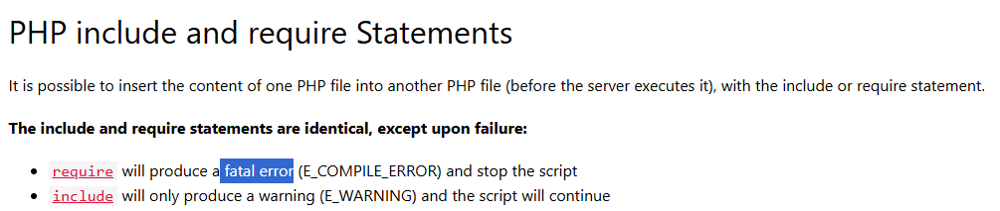

!!! error "Errores con include y require"

    [https://www.w3schools.com/php/php_includes.asp ](https://www.w3schools.com/php/php_includes.asp)

* **require** **:** Si el fichero que
  queremos incluir no se encuentra, **include** da un aviso y
  continua la ejecución del guión. La diferencia más importante al
  usar **require** es que en ese caso, cuando no se puede
  incluir el fichero, se detiene la ejecución del guión.
* **require_once** . Es la combinación de las dos anteriores.
  Asegura la inclusión del fichero indicado solo una vez, y genera un error
  si no se puede llevar a cabo.

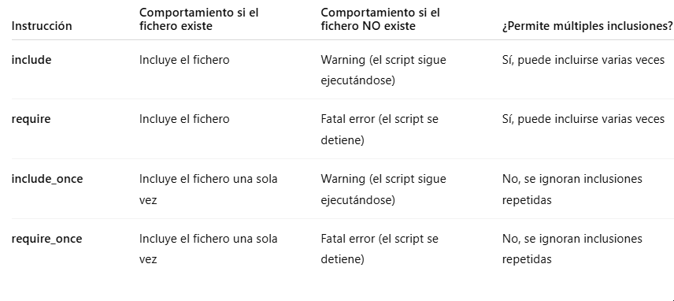

Muchos programadores utilizan la doble extensión **.inc.php** para aquellos ficheros en lenguaje PHP cuyo destino es ser incluidos dentro de otros, y nunca han de
ejecutarse por sí mismos.

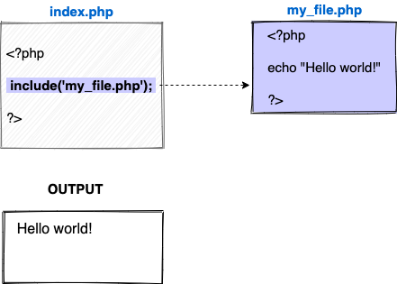

Recuerda:

La diferencia clave entre `include` y `require` es:

* `include` → si el archivo no se encuentra, muestra **warning** y el script sigue.
* `require` → si el archivo no se encuentra, lanza **fatal error** y el script se detiene.

### 💻Programa19: - CARPETA Programa19

!!! success "Programa19.php: include *(Ruta:**dwes/UD2/Entrega2/Programa19**)* "

    En vez de un script php, vamos a crear una carpeta llamada Programa19 con varios ficheros que incluiremos con INCLUDE y REQUIRE.

    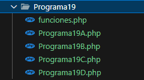

Para el **Programa19**, separa el siguiente código en diversos scripts del Programa19A, B, C, D:

```php
<?php
echo "<h2>Pruebas de include / require</h2>";

// 1. include
include "funciones.php";
echo saludar("Ana") . "<br>";

// 2. require
require "funciones.php";
echo despedir("Luis") . "<br>";

// 3. include_once (solo se incluirá una vez)
include_once "funciones.php";
include_once "funciones.php"; // se ignora
echo "3 x 4 = " . multiplicar(3, 4) . "<br>";

// 4. require_once (solo se incluirá una vez)
require_once "funciones.php";
require_once "funciones.php"; // se ignora
echo "20 / 5 = " . dividir(20, 5) . "<br>";
?>

```

Para el código de **funciones.php**, puedes usar:

```php
<?php
function saludar($nombre) {
    return "Hola, $nombre. Bienvenido.";
}

function despedir($nombre) {
    return "Adiós, $nombre. Hasta pronto.";
}

function multiplicar($a, $b) {
    return $a * $b;
}

function dividir($a, $b) {
    if ($b == 0) {
        return "Error: división por cero";
    }
    return $a / $b;
}
?>
```

#### Actividad

!!! success "Actividad"

    Crea una estructura con dos ficheros donde uno sea incluido parecida a la del ejemplo y ejecútala

    Prueba todas estas características en uno o varios scripts HTML+PHP en la ruta -**SemanaN/inclusionFicheros/nombredetuscripts.php**

## Funciones PHP Más usadas.

A continuación se enlazan varios artículos donde relacionan algunas de las funciones nativas de PHP más utilizadas

* [ ] [Funciones más usadas (Aula Clic)	](https://www.aulaclic.es/paginas-web/a_11_3_1.htm#google_vignette)
* [ ] [Funciones nativas de PHP más usadas I. (Artesanía Web)](https://www.artesaniaweb.es/articulo.php?titulo=funciones-nativas-de-php-mas-usadas-i-1i4zf)
* [ ] [Programación .net](https://programacion.net/articulo/7-funciones-muy-poco-conocidas-de-php-pero-que-son-muy-utiles_1660)

* [ Manual PHP. Todas las funciones](https://www.php.net/manual/es/indexes.functions.php)

<iframe width="1236" height="695" src="https://www.youtube.com/embed/hq2_-1xoHQ4" title="¿Qué funciones son las más usadas en php?" frameborder="0" allow="accelerometer; autoplay; clipboard-write; encrypted-media; gyroscope; picture-in-picture; web-share" referrerpolicy="strict-origin-when-cross-origin" allowfullscreen></iframe>

### 💻Programa20: Funciones + usadas

!!! success "Programa20.php: Funciones usadas *(Ruta:**dwes/UD2/Entrega2/**)* "

    Navega por los enlaces anteriores, investiga y utiliza algunas de las funciones más importantes que veas, documéntalas en tu readme*Entrega2.m*d. **Prueba al menos 8** de estas características en uno o varios scripts HTML+PHP en la ruta. Deberás elegir una para explicar a tus compañeros al menos una función que no se haya visto

---

## Extensiones

Como programador puedes aprovecharte de la gran cantidad de funciones  **disponibles en PHP** . De
éstas, muchas están incluidas en el núcleo de PHP y se pueden usar
directamente. Otras muchas se encuentran disponibles en forma de  **extensiones** ,
y se pueden incorporar al lenguaje cuando se necesitan.

Con la distribución de
PHP se incluyen varias extensiones. Para poder usar las funciones de una
extensión, tienes que asegurarte de activarla mediante el uso de una
directiva **extensión** en el fichero  **php.ini** . Muchas
otras extensiones no se incluyen con PHP y antes de poder utilizarlas tienes
que descargarlas.

Para obtener extensiones
para el lenguaje PHP puedes utilizar PECL. PECL es un **repositorio de extensiones**
para PHP. Junto con PHP se incluye un **comando pecl** que puedes
utilizar para instalar extensiones de forma sencilla:

### Instalar extensiones

!!! info "Extensiones"

    Por ahora no dedicaremos tiempo en clase para instalar alguna extensión hasta que no sean requeridas

    Puedes indagar un poco más al respecto en

* [https://www.php.net/manual/es/install.pecl.windows.php](https://www.php.net/manual/es/install.pecl.windows.php)
* [https://pecl.php.net/](https://pecl.php.net/)
* [https://diego.com.es/extensiones-en-php](https://diego.com.es/extensiones-en-php),

---

# Actividad Entregable

!!! success "Entregable"

    Tienes la info en la sección "[Actividad entregable](Entregable.md)"

## Presentación

<iframe src="https://docs.google.com/presentation/d/e/2PACX-1vR9ZH4fK1yBR1yuhvDmYUik3wr7WOx99Tq2hOne3T70B4UEmQEEIX_dCNbbeA1mkJHABEJPuQhHPPf9/pubembed?start=false&loop=false&delayms=60000" frameborder="0" width="960" height="569" allowfullscreen="true" mozallowfullscreen="true" webkitallowfullscreen="true"></iframe>
