#### UD 2 El lenguaje PHP. 6 Arrays

**Duración Estimada**: 8 sesiones, 16 horas

??? note "RA2 Escribe sentencias ejecutables por un servidor Web reconociendo y aplicando procedimientos de **integración del código en lenguajes de marcas**."

    > *  A Se han reconocido los mecanismos de generación de páginas Web a partir de lenguajes de marcas con código embebido.
    > *  B Se han identificado las principales tecnologías asociadas.
    > *  C Se han utilizado etiquetas para la inclusión de código en el lenguaje de marcas.
    > *  D Se ha reconocido la sintaxis del lenguaje de programación que se ha de utilizar.
    > *  E Se han escrito sentencias simples y se han comprobado sus efectos en el documento resultante.
    > *  F Se han utilizado directivas para modificar el comportamiento predeterminado.
    > *  G Se han utilizado los distintos tipos de variables y operadores disponibles en el lenguaje.
    > *  H Se han identificado los ámbitos de utilización de las variables.

!!! note "RA3 Escribe bloques de sentencias embebidos en lenguajes de marcas, seleccionando y utilizando las **estructuras de programación**. "

    > *  A Se han utilizado mecanismos de**decisión** en la creación de bloques de sentencias.
    > *  B Se han utilizado **bucles** y se ha verificado su funcionamiento.
    > *  C Se han utilizado «**arrays**» para almacenar y recuperar conjuntos de datos.
    > *  D Se han creado y utilizado **funciones**.
    > *  E Se han utilizado **formularios** Web para interactuar con el usuario del navegador Web.
    > *  F Se han empleado métodos para **recuperar** la información introducida en el formulario.
    > *  G Se han añadido **comentarios** al código

!!! abstract "OBJETIVOS Entrega 2"

    Estructuras de control, Creación de funciones y formularios

---

## Introducción

En la clase anterior estudiamos bucles, condicionales y otras estructuras de control del flujo. Hoy veremos Funciones y arrays.

# 1 Arrays

> *RA3: Escribe bloques de sentencias embebidos en lenguajes de marcas, seleccionando y utilizando las estructuras de programación. C.Ev. C Se han utilizado «arrays» para almacenar y recuperar conjuntos de datos..*

Un tipo de datos compuesto es aquel que te permite almacenar más de un valor. En PHP puedes utilizar dos tipos de datos compuestos: el **array** y el  **objeto** .

* Los objetos los veremos más adelante; vamos a empezar con los arrays.
* Un **array** es un tipo de datos que nos permite almacenar varios valores.
* Cada miembro del **array** se almacena en una posición a la que se hace referencia utilizando un valor clave.
* Las **claves** pueden ser numéricas o asociativas.
* La **clave** puede ser un [integer](https://www.php.net/manual/es/language.types.integer.php) o un [string](https://www.php.net/manual/es/language.types.string.php).
* El **valor** puede ser de cualquier tipo.

[Enlace a Documentación Array](https://www.php.net/manual/es/language.types.array.php)

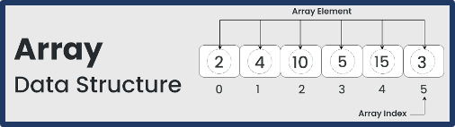

Para hacer referencia a los elementos almacenados en un array, tienes que utilizar el valor clave entre  **corchetes** :

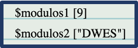

**La función array permite crear un array con una
sola línea de código**

1. Esta función recibe
   un conjunto de parámetros, y crea un array a partir de los valores
   que se le pasan.
2. Si en los parámetros no se indica el valor de la clave, crea
   un array **numérico** (con base 0).
3. Si no se le pasa ningún
   parámetro, crea un array **vacío**.

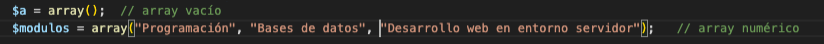

### 💻Programa21: Array

!!! success "Programa21.php: Array*(Ruta:**dwes/UD2/Entrega2/**)* "

    Prueba a definir estos dos arrays y a mostrar un valor de cada uno

```php
php
<?php
//Ejemplo Definición de array simple

$array1 = array(
    "foo" => "bar",
    "bar" => "foo",
);

// a partir de PHP 5.4
$array2 = [
    "foo" => "bar",
    "bar" => "foo",
];

//mostrar un valor de cada uno

?>
```

!!! info print_r

    Recuerda, la función**print_r** , que nos muestra todo el contenido del array que le pasamos. Es muy útil para tareas de depuración.

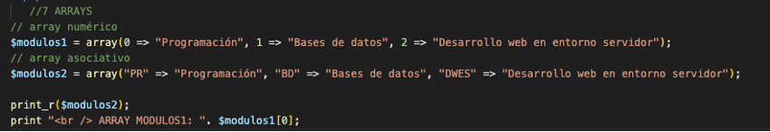

## 1.1 Arrays Multidimensionales

Los arrays anteriores son vectores, esto es, arrays **unidimensionales**.

* En PHP puedes crear también arrays de **varias dimensiones** almacenando otro array en cada uno de los elementos
  de un array.
* Para hacer referencia a los elementos almacenados en un  **array multidimensional**, debes indicar las claves para cada una de las dimensiones

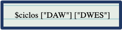

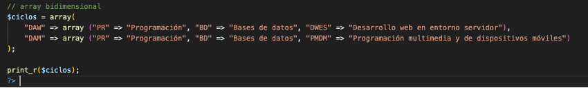

* En PHP no es necesario que indiques el **tamaño** del array antes de crearlo.
  Ni siquiera es necesario indicar que una variable concreta es de
  tipo array. Simplemente puedes comenzar a asignarle valores:
* Tampoco es necesario que especifiques el **valor** de la clave. Si la omites,
  el array se irá llenando a partir de la última clave numérica
  existente, o de la **posición 0** si no existe ninguna:

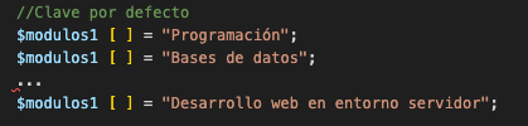

## 💻Programa21: -Array (ampliación)

!!! success "Programa21.php: Switch *(Ruta:**dwes/UD2/Entrega2/**)* "

    Crea el anterior array ciclos. Observa cómo se rellena poco a poco el siguiente array "modulos1" y amplía así el programa 21

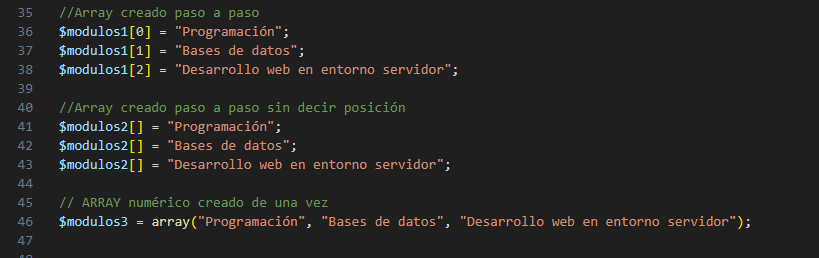

---

## 1.2 Recorrer Arrays (foreach)

Las **cadenas de texto** o **strings** se pueden tratar como arrays en los que se almacena una letra en cada
posición, siendo 0 el índice correspondiente a la primera letra, 1 el de la segunda, etc.

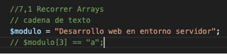

Para recorrer los
elementos de un array, en PHP puedes usar un bucle específico:  **foreach** . Utiliza una
variable temporal para asignarle en cada iteración el valor de cada uno de los
elementos del array. Puedes usarlo de dos formas.

### Solo elementos

·     Recorriendo sólo los elementos:

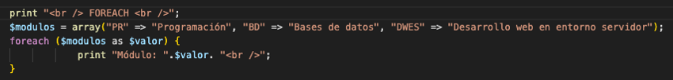

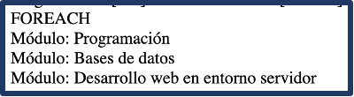

### Clave - Valor

·     O recorriendo sus **valores clave **y sus **elementos**
de forma simultánea:


## 💻Programa22: Arrays multidimensionales

!!! success "Programa23.php: Recorrer arrays *(Ruta:**dwes/UD2/Entrega2/**)* "

    Corrige y documenta el siguiente bloque de código

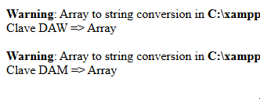

```php
<?php
$ciclos = array( 
    "DAW" => array(     "PR"   => "Programación",    "BD"   => "Bases de datos",    "DWES" => "Desarrollo web en entorno servidor"),
    "DAM" => array(     "PR"   => "Programación",    "BD"   => "Bases de datos",    "SGE" => "Sistemas de gestión empresarial")
);

//Array creado paso a paso
$modulos1[0] = "Programación";
$modulos1[1] = "Bases de datos";
$modulos1[2] = "Desarrollo web en entorno servidor";

// Mostrar elementos de array numérico
echo "<h3>Array numérico</h3>";
for ($i = 0; $i < count($modulos1); $i++) {
    echo "Módulo $i: " . $modulos1[$i] . "<br>";
}

// Mostrar elementos de array asociativo
echo "<h3>Array asociativo</h3>";
foreach ($ciclos as $clave => $valor) {
    echo "Clave $clave => $valor <br>";
}


?>
```

---

## 1.3 Funciones para recorrer Arrays (next, prev…)]

Pero en PHP
también hay otra **forma** de recorrer los valores de un array. Cada
array mantiene un **puntero** interno,
que se puede utilizar con este fin. Utilizando funciones específicas, podemos  **avanzar,
retroceder o inicializar el puntero** , así como **recuperar**
los valores del elemento (o de la pareja CLAVE / VALOR) al que apunta el
puntero en cada momento.

Algunas de estas
funciones son:

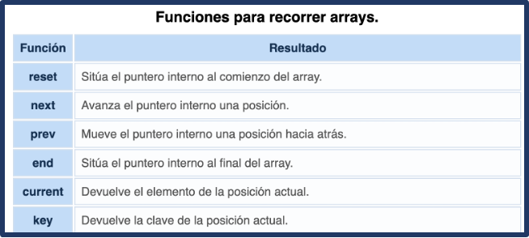

!!! bug "each"

    each ha sido eliminado desde la versión 8 de PHP;

Las funciones  **reset** ,  **next** , **prev** y  **end** ,
además de mover el puntero interno devuelven, al igual que  **current** ,
el valor del nuevo elemento en que se posiciona. Si al mover el puntero te
sales de los límites del array (por ejemplo, si ya estás en el último elemento
y haces un  **next** ), cualquiera de ellas devuelve  **false** .

* Sin embargo, al comprobar este valor devuelto no serás capaz de distinguir si te has salido
  de los límites del array, o si estás en una posición válida del array que
  contiene el valor "false".
* La función **key** devuelve **null** si
  el puntero interno está **fuera** del array.

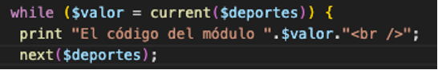

## 💻Programa23: Recorrer arrays

!!! success "Programa23.php: Recorrer arrays *(Ruta:**dwes/UD2/Entrega2/**)* "

    Completa el programa con las funciones para recorrer arrays vistas.

```php
<?php
// Definir el array con ciudades
$ciudades = array("Sevilla", "Granada", "Córdoba", "Málaga", "Cádiz");

/* Programa23: COPIA COLOCA LAS FUNCIONES DONDE CORRESPONDADN :
next($ciudades) 
reset($ciudades) 
prev($ciudades) 
end($ciudades) 
*/

// 1. "FUNCION ARRAY ???" → primer elemento
echo "Primer elemento con : " . "FUNCION ARRAY ???" . "<br>";
echo "Clave actual: " . key($ciudades) . "<br><br>";

// 2. "FUNCION ARRAY ???" → avanzar
echo "Siguiente Elemento con : " . "FUNCION ARRAY ???"  . "<br>";
echo "Clave actual: " . key($ciudades) . "<br><br>";

// 3. "FUNCION ARRAY ???" → retroceder
echo "Elemento con  : " . "FUNCION ARRAY ???"  . "<br>";
echo "Clave actual: " . key($ciudades) . "<br><br>";

// 4. "FUNCION ARRAY ???" → último elemento
echo "Último elemento con : " . "FUNCION ARRAY ???"  . "<br>";
echo "Clave actual: " . key($ciudades) . "<br><br>";

// 5. next() después del último → fuera del array
$valor = next($ciudades);
if ($valor === false && key($ciudades) === null) {
    echo "El puntero está fuera del array (hemos pasado el final).<br>";
} else {
    echo "Elemento actual: $valor<br>";
}

//Vamos a forzar a forzar que se muestre
echo "Elemento con next() fuera del array: " . next($ciudades) . "<br>";
echo "Clave actual: " . key($ciudades) . "<br><br>";
?>
```

---

## 1.4 Funciones datos compuestos (array, unset…)]()

Una vez definido
un array puedes añadir **nuevos elementos** y **modificar** los ya existentes (utilizando el **índice**
del elemento a modificar).

* También se pueden **eliminar** elementos de
  un array utilizando la función  **unset** .
* En el caso de
  los arrays numéricos, eliminar un elemento significa que las claves
  del mismo ya no estarán **consecutivas**.

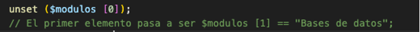

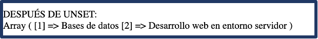

* La función **array_values** recibe
  un array como parámetro, y devuelve un nuevo array con los
  mismos elementos y con índices numéricos consecutivos con base 0.
* Para comprobar si una
  variable es de tipo array, utiliza la función  **is_array** . Para
  obtener el número de elementos que contiene un array, tienes la
  función  **count** .
* Si
  quieres **buscar** un elemento concreto dentro de un array, puedes
  utilizar la función  **in_array** .
  Recibe como parámetros el elemento a buscar y la variable de
  tipo array en la que buscar, y devuelve true si encontró el elemento
  o false en caso contrario.

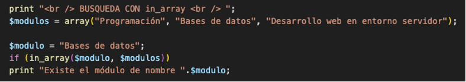

* Otra posibilidad es la
  función  **array_search** ,
  que recibe los mismos parámetros pero **devuelve la clave**
  correspondiente al elemento, o false si no lo encuentra.
* Y si lo que quieres
  buscar es una clave en un array, tienes la función  **array_key_exists** ,
  que devuelve true o false.


| Acción                                | Función / Forma de uso               | Resultado                                        |
| -------------------------------------- | ------------------------------------- | ------------------------------------------------ |
| **Añadir elemento**             | `$array[] = "nuevo";`               | Agrega un elemento al final                      |
| **Modificar elemento**           | `$array[2] = "modificado";`         | Cambia el valor en la posición indicada         |
| **Eliminar elemento**            | `unset($array[2]);`                 | Elimina el valor y deja un hueco en los índices |
| **Reindexar array numérico**    | `$array = array_values($array);`    | Reorganiza claves en orden consecutivo desde 0   |
| **Comprobar si es array**        | `is_array($array)`                  | Devuelve `true`o `false`                     |
| **Contar elementos**             | `count($array)`                     | Devuelve el número de elementos                 |
| **Buscar valor**                 | `in_array("valor", $array)`         | `true`si existe,`false`si no                 |
| **Buscar valor y obtener clave** | `array_search("valor", $array)`     | Devuelve la clave o `false`                    |
| **Buscar clave**                 | `array_key_exists("clave", $array)` | `true`si la clave existe,`false`si no        |


## 💻Programa24: Funciones arrays

!!! success "Programa24.php: Funciones para arrays *(Ruta:**dwes/UD2/Entrega2/**)* "

    Prueba todas estas características en un programa PHP que contenga todas las funciones anteriores y documéntalo.

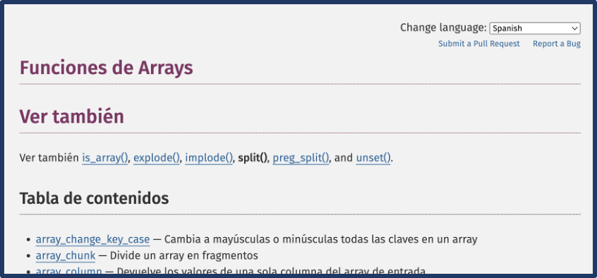

[Enlace Documentación Arrays](https://www.php.net/manual/es/ref.array.php)

---


# Actividad Entregable

!!! success "Entregable"

    Tienes la info en la sección "[Actividad entregable](Entregable.md)"

## Presentación

<iframe src="https://docs.google.com/presentation/d/e/2PACX-1vTF0_vQePJAT2OyUjiCklvlddHmsyG232ujt2ueIP57MdJLfkqb83cnxtWcimPVt2PQQCgGGrWgoeJs/pubembed?start=false&loop=false&delayms=60000" frameborder="0" width="960" height="569" allowfullscreen="true" mozallowfullscreen="true" webkitallowfullscreen="true"></iframe>
