## UD 2 El lenguaje PHP. 7 Formularios

**Duración Estimada de la unidad**: 12 sesiones, 24 horas

??? note "RA2 Escribe sentencias ejecutables por un servidor Web reconociendo y aplicando procedimientos de **integración del código en lenguajes de marcas**."

    > *  A Se han reconocido los mecanismos de generación de páginas Web a partir de lenguajes de marcas con código embebido.
    > *  B Se han identificado las principales tecnologías asociadas.
    > *  C Se han utilizado etiquetas para la inclusión de código en el lenguaje de marcas.
    > *  D Se ha reconocido la sintaxis del lenguaje de programación que se ha de utilizar.
    > *  E Se han escrito sentencias simples y se han comprobado sus efectos en el documento resultante.
    > *  F Se han utilizado directivas para modificar el comportamiento predeterminado.
    > *  G Se han utilizado los distintos tipos de variables y operadores disponibles en el lenguaje.
    > *  H Se han identificado los ámbitos de utilización de las variables.

!!! note "RA3 Escribe bloques de sentencias embebidos en lenguajes de marcas, seleccionando y utilizando las **estructuras de programación**. "

    > *  E Se han utilizado**formularios** Web para interactuar con el usuario del navegador Web.

!!! abstract inline end "OBJETIVOS Entrega 2"

    Estructuras de control, Creación de funciones y formularios

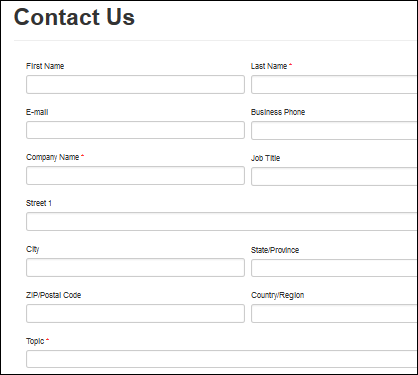

---

# Introducción

En las clases anteriores, estudiamos arrays y algunas de las funciones más importantes. En este apartado, pondremos en práctica muchas de ellas a través de un elemento fundamental en la arquitectura cliente-servidor, los **formularios**

Uno de los puntos fuertes de PHP es su capacidad para manejar formularios.

* El concepto básico que es importante entender es que todos los campos de un formulario estarán automáticamente disponibles en el script PHP de **acción**.
* Lea el capítulo del manual relativo a las [variables desde fuentes externas a PHP](https://www.php.net/manual/es/language.variables.external.php) para más información y ejemplos sobre cómo utilizar los formularios.

---

# 1. Elementos básicos de los formularios:

**ACTION, METHOD...**

La forma natural para
hacer llegar a la aplicación web los datos del usuario desde un navegador, es
utilizar  **formularios
HTML** .

Los formularios HTML van
encerrados siempre entre las etiquetas  **`<FORM>` `</FORM>`** .
Dentro de un formulario se incluyen los elementos sobre los que puede actuar el
usuario, principalmente usando las etiquetas  **`<INPUT>`** ,  **`<SELECT>`** , **`<TEXTAREA>`** y  **`<BUTTON>`** .

El atributo **action** del
elemento **FORM** indica la página a la que se le enviarán los
datos del formulario. En nuestro caso se tratará de un guión PHP.

Por su parte, el
atributo **method** especifica
el método usado para enviar la información. Este atributo puede tener dos
valores:

* **get** : con este método los datos del formulario se agregan al URI
  utilizando un signo de interrogación "?" como separador.
* **post** : con este método los datos se incluyen en el cuerpo del formulario y
  se envían utilizando el protocolo HTTP.

Como vamos a ver, los datos se recogerán de distinta forma dependiendo de cómo se envíen.

!!! alert "Carpetas para cada FORM"

    A partir de ahora, cada formulario tendrá más de un script, por lo que generaremos los archivos por carpetas con el número del programa

    Fíjate como muchos formularios llevarán sólo extensión HTML.

    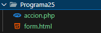

### 💻Programa25: Formulario básico con HTML

!!! success "Programa25: form**.html** / accion**.php** *(Ruta:**dwes/UD2/Entrega2/Programa25/**)* "

    Prueba el funcionamiento del siguiente programa y anota en tus apuntes, además de una captura: qué método usa, dónde se llama a PHP y cómo se almacena las variables

**form.html**

```html
<!doctype html>
<html lang="es">
<head>
  <meta charset="utf-8">
  <title>Formulario básico</title>
</head>
<body>
  <h1>Formulario de contacto</h1>
  <form method="post" action="accion.php">
    <p>
      <label>Nombre: 
        <input type="text" name="nombre" required>
      </label>
    </p>
    <p>
      <label>Email: 
        <input type="email" name="email" required>
      </label>
    </p>
    <p>
      <label>Mensaje:<br>
        <textarea name="mensaje" rows="4" cols="40" required></textarea>
      </label>
    </p>
    <p>
      <button type="submit">Enviar</button>
    </p>
  </form>
</body>
</html>

```

**accion.php**

```
<?php
// form.php - recoge y muestra datos del formulario

//almacenamos las variables superglobales en variables locales tras tratar los carácteres especiales
// ?? '' indica que si no se ha recibido, se pone una cadena vacía
if ($_SERVER["REQUEST_METHOD"] === "POST") {
    $nombre  = htmlspecialchars($_POST['nombre'] ?? '');
    $email   = htmlspecialchars($_POST['email'] ?? '');
    $mensaje = htmlspecialchars($_POST['mensaje'] ?? '');
}
?>
<!doctype html>
<html lang="es">
<head>
  <meta charset="utf-8">
  <title>Datos recibidos</title>
</head>
<body>
  <h1>Datos recibidos del formulario</h1>
  <?php if (!empty($nombre) && !empty($email) && !empty($mensaje)): ?>
    <p><strong>Nombre:</strong> <?php echo $nombre; ?></p>
    <p><strong>Email:</strong> <?php echo $email; ?></p>
    <p><strong>Mensaje:</strong><br><?php echo nl2br($mensaje); ?></p>
  <?php else: ?>
    <p style="color:red;">No se recibieron todos los datos correctamente.</p>
  <?php endif; ?>
</body>
</html>
```

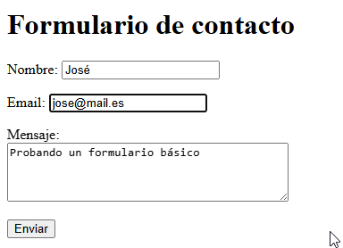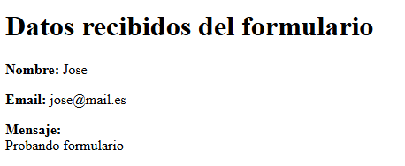

---

## 1.1 Mostrar Información de nuestro formulario HTML (GET y POST)

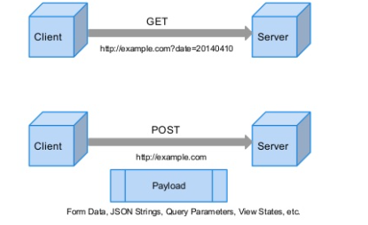

Cuando se envía la información un formulario a un script de PHP, la información de dicho formulario pasa a estar automáticamente disponible en el script.

* Existen diversas formas de acceder a esta información, por ejemplo:

**Mostrar información de nuestro formulario action.php**

```php
Hola <?php echo htmlspecialchars($_POST['nombre']); ?>.
Usted tiene <?php echo (int)$_POST['edad']; ?> años.
```

Un ejemplo del resultado de este script podría ser:

```
Hola José. Usted tiene 22 años.
```

[Enlace a Documentación](https://www.php.net/manual/es/tutorial.forms.php)

No hay nada especial en este formulario. Es solamente un formulario HTML sin ninguna clase de etiqueta especial. Cuando el usuario rellena este formulario y oprime el botón de envío, **se llama a la página accion.php**.

---

## 💻Programa26: Formulario/Procesa

!!! success "Programa26 *(Ruta:**dwes/UD2/Entrega2/Programa26**)* "

    Prueba a definir estos dos script y a modiciar cómo se muestra la información pasada, qué valores llevarán**name & value**?

    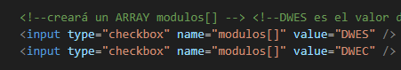

    Crea en la carpeta un**formulario HTML** llamado **form.html** para introducir el nombre del alumno y el **módulo** que cursa, a escoger entre “Desarrollo Web en Entorno Servidor” y “Desarrollo Web en Entorno Cliente”.

    Envía el resultado a la página**“procesa.php”** , que será la encargada de procesar los datos.

    Comenta cómo se pasa el array cuando sólo se indica uno de los dos módulos

* [ ] **form.html**

```html
<!DOCTYPE HTML PUBLIC "-//W3C//DTD HTML 4.01 Transitional//EN" "
http://www.w3.org/TR/html4/loose.dtd">
<!-- Desarrollo Web en Entorno Servidor -->
<!-- Tema 2 : Características del Lenguaje PHP -->
<!-- Ejemplo: Formulario web -->
<html>
     <head>
          <meta http-equiv="Content-Type" content="text/html; charset=UTF-8">
          <title>Formulario</title>
     </head>

     <body>
          <!-- Formulario de nombre input, action es la que me relaciona con el bloque para procesar -->
          <!-- method=  post o get -->
<form name="input" action="procesa.php" method="post">

                         <!--creará una variable nombre -->
     Nombre del alumno: <input type="text" name="nombre" /><br />
          <p>Ciclos que cursa:</p>

          <!--creará un ARRAY modulos[] --> <!--DWES es el valor del 1er elemento del array y DWEC el segundo --> 
          <input type="checkbox" name="????" value="???" /> Desarrollo web en entorno servidor <br/>
          <input type="checkbox" name="????" value="????" /> Desarrollo web en entorno cliente<br/>
  
  
          <br/>
          <!--creará una variable con valor "Enviar" -->
          <input type="submit" value="Enviar" />
  

</form>
     </body>
</html>
```

* [ ] **procesa.php**

```php
<!DOCTYPE HTML PUBLIC "-//W3C//DTD HTML 4.01 Transitional//EN" "
http://www.w3.org/TR/html4/loose.dtd">
<!-- Desarrollo Web en Entorno Servidor -->
<!-- Tema 2 : Características del Lenguaje PHP -->
<!-- Ejemplo: Procesar datos post -->
<html>
     <head>
          <meta http-equiv="Content-Type" content="text/html; charset=UTF-8">
          <title>Programa 26</title>
     </head>
     <body>
<?php
     //Recogemos los valores de las variables.
     $nombre = $_POST['nombre'];
     $modulos = $_POST['modulos']; // esta es un array de valores
  
     print "Nombre: ".$nombre."<br />";

     foreach ($modulos as $clave => $modulo) {
          print "Clave:". $clave . " Modulo: ".$modulo."<br />";
     }
?>
     </body>
</html>
```

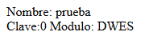

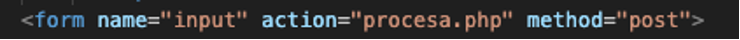

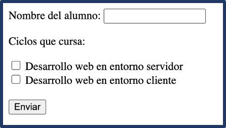

!!! abstract "arrays!"

    Fíjate que si en un formulario web tienes que enviar alguna variable en la que sea posible**almacenar más de un valor** , como es el caso de las **casillas** de verificación en el ejemplo anterior (se pueden marcar varias a la vez), tendrás que ponerle corchetes al nombre de la variable para indicar que se trata de un  **array** .

---

## 1.2 Dominio del lenguaje HTML

Para no tener problemas al programar en PHP, debes conocer el lenguaje  **HTML** , concretamente los
detalles relativos a la creación de **formularios** web.

* Completa tu formación desde el módulo Diseño de interfaces
* Puedes consultar otros cursos como el de AulaClic:

[https://www.aulaclic.es/html/t_8_1.htm](https://www.aulaclic.es/html/t_8_1.htm)

---

# 2. Procesamiento de la información

En el ejemplo anterior creaste un **formulario en una página HTML** que recogía datos del usuario y los enviaba a una página PHP para que los procesara.

* Como usaste el método  **POST** , los datos se pueden recoger utilizando la variable  **$_POST** .
* Si simplemente los quisieras mostrar por pantalla, este podría ser el código de **"procesa.php":**

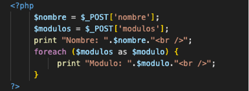

* Si por el contrario hubieras usado el método  **GET** , el código necesario para procesar los datos sería
  similar; simplemente haría falta cambiar la variable   **POST por GET** .

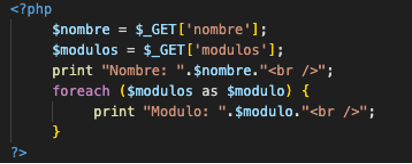

* En **cualquiera** de los dos casos, podrías haber usado **$_REQUEST**

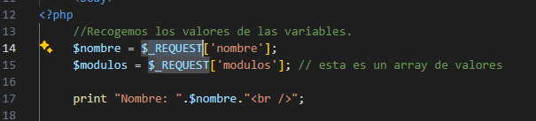

## 💻Programa27: Request

!!! success "Programa27 *(Ruta:**dwes/UD2/Entrega2/Programa27**)* "

    **Duplica** el Programa 26 para crear el 27 sólo cambiando la variable por **REQUEST.** Anota diferencias, ¿qué action se puede usar desde el form?

---

## 2.1 Validación de datos.

Siempre que sea posible, es preferible  ***validar* los datos que se introducen en el
navegador antes de enviarlos** . Para ello deberás usar código en **lenguaje Javascript.**

Si por algún motivo hay datos que se tengan que validar en el servidor, por ejemplo, porque necesites
comprobar que los datos de un usuario no existan ya en la base de datos antes de introducirlos, será necesario hacerlo con código PHP en la página que figura
en el atributo **action** del formulario.

En este caso, una posibilidad que deberás tener en cuenta es **usar la misma página** que muestra el formulario como destino de los datos.

* Si tras comprobar los datos éstos son **correctos**, se reenvía a otra página.
* Si son **incorrectos**, se **rellenan** los datos correctos en el formulario (con las variables enviadas previamente) y se indican cuáles son incorrectos y por qué.
* Para hacerlo de este modo, tienes que comprobar si **la página recibe datos** (hay que mostrarlos y no generar el formulario), o si **no recibe** datos (hay que mostrar el formulario).
* Esto se puede hacer utilizando la función **isset** con una variable de las que se deben recibir (por ejemplo, poniéndole un nombre al botón de enviar y
  comprobando sobre él).

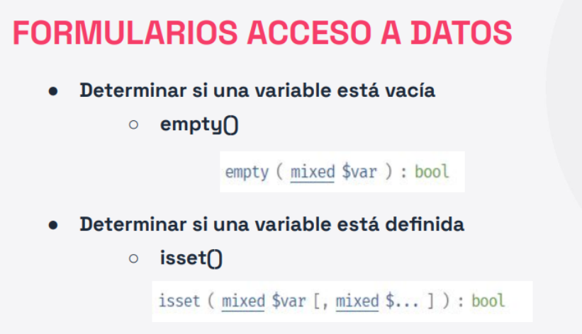

En el siguiente código de ejemplo aprenderemos cómo hacerlo.

## 2.2 Empty, value, checked, in_array

Para que el usuario no pierda, después de enviar el formulario, los datos correctamente introducidos, utiliza el atributo **value** en
las entradas de texto

* [ ] Utilizamos la función **isset** para comprobar que la variable que queremos mostrar existe
* [ ] Esto es para que no nos muestre un mensaje de error si es la primera vez que se carga la página y todavía no ha enviado nada el formulario):

```php
 Nombre del alumno:
          <!-- COMPROBACION 2: Si pulsas botón enviar con el nombre, te lo mantiene en el formulario-->
          <input type="text" name="nombre" value="<?php if (isset ($_POST['nombre'])) echo $_POST['nombre'];?>" />
```

* [ ] Y el atributo **checked** en las casillas de verificación:

```php
  <input type="checkbox" name="modulos[]" value="DWES"
               <?php
               //COMPROBACIÓN 5: Si hemos seleccionado algún módulo, buscamos si este primer módulo fue seleccionado para marcarlo
                    if(in_array("DWES",$_POST['modulos']))
                         echo 'checked="checked"'; 
               ?>
```

* Fíjate en el uso de la función **in_array** para buscar un elemento en un array.

Después, para indicar al usuario los datos que **no ha rellenado** (o que ha rellenado de forma incorrecta):

- deberás comprobar si es la primera vez que se visualiza el formulario, o si ya se ha **enviado**.

```php
  <?php
               //COMPROBACION 3: En este caso, se ha pulsado el botón ENVIAR pero no se ha introducido un nombre: 
               if (isset($_POST['enviar']) && empty($_POST['nombre']))
               //Imprimo el error en PHP
                    e
```

## 💻Programa28: Comprobando

!!! success "Programa28 *(Ruta:**dwes/UD2/Entrega2/Programa28**)* "

    **Crea** el siguiente Programa28.php (no necesitas carpeta) y analiza lo que hemos visto anteriormente

    Con todo esto afianzado vamos a crear el siguiente programa más complejo.

* **Programa28.php**

```php
<?php
// Procesar el formulario al enviarlo
if ($_SERVER["REQUEST_METHOD"] == "POST") {

    // 1️ Comprobar si el nombre está vacío
    if (empty($_POST["nombre"])) {
        echo "<p style='color:red;'>El campo nombre está vacío.</p>";
    } else {
        echo "<p>Nombre: " . htmlspecialchars($_POST["nombre"]) . "</p>";
    }

    // 2️ Comprobar las aficiones (checkboxes)
    if (!empty($_POST["aficiones"])) {
        $aficiones = $_POST["aficiones"];
        echo "<p>Aficiones seleccionadas: " . implode(", ", $aficiones) . "</p>";

        // 3️ Verificar si “deporte” está entre las seleccionadas
        if (in_array("deporte", $aficiones)) {
            echo "<p>Te gusta el deporte! </p>";
        }
    } else {
        echo "<p>No has marcado ninguna afición.</p>";
    }
}
?>

<form method="post" action="">
    <label>Nombre:</label>
    <input type="text" name="nombre" 
           value="<?php echo isset($_POST['nombre']) ? htmlspecialchars($_POST['nombre']) : ''; ?>">
    <br><br>

    <label>Aficiones:</label><br>
    <input type="checkbox" name="aficiones[]" value="musica"
        <?php if (!empty($_POST['aficiones']) && in_array('musica', $_POST['aficiones'])) echo "checked"; ?>>
        Música<br>

    <input type="checkbox" name="aficiones[]" value="deporte"
        <?php if (!empty($_POST['aficiones']) && in_array('deporte', $_POST['aficiones'])) echo "checked"; ?>>
        Deporte<br>

    <input type="checkbox" name="aficiones[]" value="lectura"
        <?php if (!empty($_POST['aficiones']) && in_array('lectura', $_POST['aficiones'])) echo "checked"; ?>>
        Lectura<br><br>

    <input type="submit" value="Enviar">
</form>

```

---

## 2.3 PHP_SELF

Fíjate ahora en la forma de englobar el formulario dentro de una sentencia **else** para que sólo se genere si no se reciben datos en la página.

Además, para enviar los atos a la misma página que contiene el formulario puedes usar **$_SERVER['PHP_SELF']** para
obtener su nombre; esto hace que no se produzca un error aunque la página se cambie de nombre.

## 💻Programa29: Procesa/Valida

!!! success "Programa98 *(Ruta:**dwes/UD2/Entrega2/Programa28**)* "

    **Crea** el script 1procesa.php dentro de la carpeta del programa y muestra el **warning** que se produce cuando NO seleccionas ningún módulo. Debes **mejorar** el código validando esos datos haciendo uso de las diapositivas de clase (final de documento).

Revisa el documento con el ejemplo completo, fijándote en las **partes** que hemos comentado anteriormente y documéntalo en tu readme

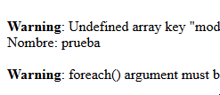

```php
<!DOCTYPE HTML PUBLIC "-//W3C//DTD HTML 4.01 Transitional//EN" "
http://www.w3.org/TR/html4/loose.dtd">
<!-- Desarrollo Web en Entorno Servidor -->
<!-- Tema 2 : Características del Lenguaje PHP -->
<!-- Ejemplo: Procesar datos en la misma página que el formulario -->
<html>
     <head>
          <meta http-equiv="Content-Type" content="text/html; charset=UTF-8">
          <title>Desarrollo Web</title>
     </head>
     <body>
<?php

          //Se muestrta solo si se ha pulsado el botón ENVIAR (isset)
     if (isset($_POST['boton_enviar'])) {
          $nombre = $_POST['nombre'];
          $modulos = $_POST['modulos'];
          print "Nombre: ".$nombre."<br />";
          foreach ($modulos as $modulo) {  //Warning key undefined
               print "Modulo: ".$modulo."<br />";
          }
     }
     else {
?>   <!-- ACTION: le indicamos PHP_SELF ya que se va a REDIRIGIR a este mismo archivo -->
          <form name="input"      action="<?php $_SERVER['PHP_SELF'];?>"      method="post">
               Nombre del alumno: <input type="text" name="nombre" /><br />
       
               <p>Módulos que cursa:</p>
               <input type="checkbox" name="modulos[]" value="DWES" />
               Desarrollo web en entorno servidor<br />
               <input type="checkbox" name="modulos[]" value="DWEC" />
               Desarrollo web en entorno cliente<br />
               <br />

               <!-- Ahora el botón submit tiene un atributo name "boton_enviar" -->
               <input type="submit" value="Enviar" name="boton_enviar"/>
          </form>
<?php
     }
?>
     </body>
</html>
```

* Para crear el programa 2valida.php deberás usar (**en diferentes partes** del script que tendrás que organizar):

```php
<?php
     // COMPROBACIÓN 1
     // Compruebo que se haya seleccionado al menos un módulo y que el nombre NO esté vacío para MOSTRAR los datos, 
     // antes comprobabamos solo si se había pulsado enviar
     if (!empty($_POST['modulos']) && !empty($_POST['nombre'])) {
	....
          Nombre del alumno:
          <!-- COMPROBACION 2: Si pulsas botón enviar con el nombre, te lo mantiene en el formulario-->
          <input type="text" name="nombre" value="<?php if (isset ($_POST['nombre'])) echo $_POST['nombre'];?>" />
...

          <?php
               //COMPROBACION 3: En este caso, se ha pulsado el botón ENVIAR pero no se ha introducido un nombre: 
               if (isset($_POST['enviar']) && empty($_POST['nombre']))
               //Imprimo el error en PHP
                    echo "<span style='color:red'> <-- Debe introducir un nombre!!</span>";
...
          <?php // Muestro Error Si no están vacias tras pulsar el botón enviar
          //COMPROBACION 4: Si pulsamos enviar sin escoger algún módulo (vacio): imprimo el ERROR 
               if (isset($_POST['enviar']) && empty($_POST['modulos']))
                    echo "<span style='color:red'> <-- Debe escoger al menos uno!!</span>"
          ?>
....
               <?php
               //COMPROBACIÓN 5: Si hemos seleccionado algún módulo, buscamos si este primer módulo fue seleccionado para marcarlo
                    if(isset($_POST['modulos']) && in_array("DWES",$_POST['modulos']))
                         echo 'checked="checked"'; 
               ?>
...
              //COMPROBACIÓN 6: Si hemos seleccionado algún módulo, buscamos si este primer módulo fue seleccionado para marcarlo

                   if(isset($_POST['modulos']) && in_array("DWEC",$_POST['modulos']))
                         echo 'checked="checked"';
       
            ?>
```

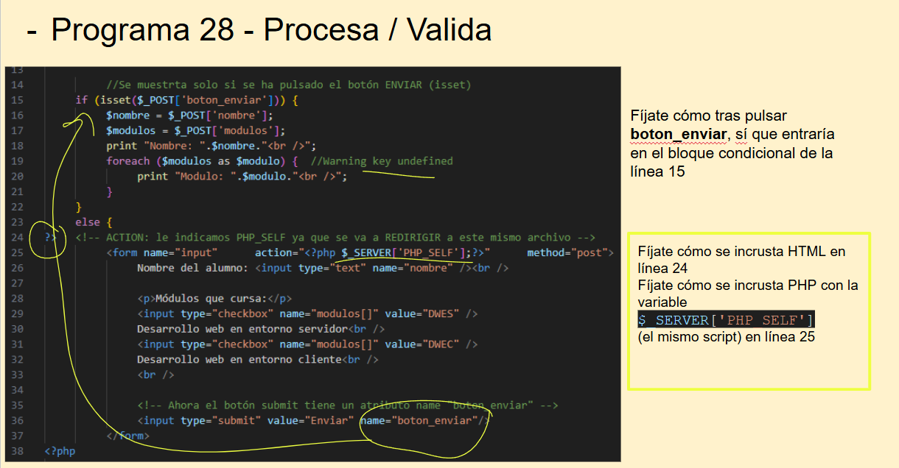

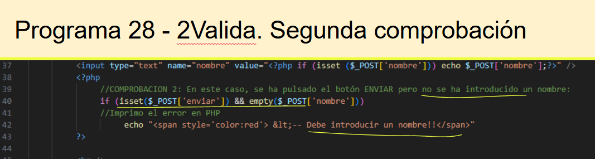

---

!!! abstract "campos ocultos en formularios"

    Otra forma de enviar información de una página PHP a otra, es incluyéndola en**campos ocultos** dentro de un formulario. [(enlace a artículo y ejemplo)](https://www.tutorialesprogramacionya.com/htmlya/temarios/descripcion.php?cod=101&punto=38&inicio=)

---


## 3. Resumen conceptos básicos Formularios

Conceptos básicos para crear formularios en PHP

1. **Formulario HTML**
   * Se crea con la etiqueta `<form>`.
   * Define el **método** (`GET` o `POST`) y la **acción** (`action="archivo.php"`).
2. **Métodos de envío (`method`)**
   * `GET`: Los datos se envían en la URL (visibles).
   * `POST`: Los datos se envían ocultos (más seguro).
3. **Atributo `action`**
   * Indica el archivo PHP que procesará los datos del formulario.
4. **Superglobales PHP**
   * `$_GET` → recibe los datos enviados por método GET.
   * `$_POST` → recibe los datos enviados por método POST.
   * `$_REQUEST` → combina ambas (no recomendada por seguridad).
   * `$_SERVER` → contiene información del servidor y del script actual.
5. **Validación de datos**
   * Comprobar si los campos están vacíos: `empty()`.
   * Validar tipos de datos (números, emails, etc.).
   * Evitar inyección de código con `htmlspecialchars()`.
6. **Reutilizar valores**
   * Usar el atributo `value` para mantener los datos tras envío fallido.
7. **Elementos especiales**
   * `checked`, `selected` e `in_array()` para mantener selección o verificar opciones marcadas.
8. **Envío y respuesta**
   * Al enviar, el PHP procesa y puede mostrar resultados, guardar en BD o redirigir.

---

## 📋 Tabla resumen: Conceptos clave en formularios PHP

| Concepto                                                                                                                      | Descripción                               | Ejemplo / Uso                                     |
| ----------------------------------------------------------------------------------------------------------------------------- | ------------------------------------------ | ------------------------------------------------- |
| `<form>`                                                                                                                    | Contenedor del formulario                  | `<form action="procesa.php" method="post">`     |
| `method`                                                                                                                    | Tipo de envío de datos (`get`/`post`) | `<form method="post">`                          |
| `action`                                                                                                                    | Archivo PHP que recibe los datos           | `action="recibe.php"`                           |
| `$_GET`                  | Recoge datos enviados por URL                  | `$_GET['nombre']`                             |                                            |                                                   |
| `$_POST`                 | Recoge datos enviados de forma oculta          | `$_POST['email']`                             |                                            |                                                   |
| `empty()`                                                                                                                   | Comprueba si un campo está vacío         | `if (empty($_POST['nombre']))`                  |
| `value`                                                                                                                     | Mantiene el valor tras envío              | `<input value="<?= $_POST['nombre'] ?? '' ?>">` |
| `checked`/`selected`                                                                                                      | Mantiene la opción elegida                | `checked`en radio/checkbox                      |
| `in_array()`                                                                                                                | Comprueba si un valor está en un array    | `in_array('php', $_POST['lenguajes'])`          |
| `htmlspecialchars()`                                                                                                        | Evita ejecución de código HTML           | `htmlspecialchars($_POST['nombre'])`            |
| `$_SERVER['PHP_SELF']`   | Procesar el mismo archivo                      | `<form action="<?= $_SERVER['PHP_SELF'] ?>">` |                                            |                                                   |

---


## 💻Programas30-35: Profundiza

!!! success "Programas 30 - 35 *(Ruta:**dwes/UD2/Entrega2/Programa30, 31 ...**)* "

    **Crea** el script 1procesa.php dentro de la carpeta del programa y muestra el **warning** que se produce cuando NO seleccionas ningún módulo. Debes **mejorar** el código validando esos datos haciendo uso de las diapositivas de clase (final de documento).

Revisa el documento con el ejemplo completo, fijándote en las **partes** que hemos comentado anteriormente y documéntalo en tu readme


---


# Mapa Conceptual

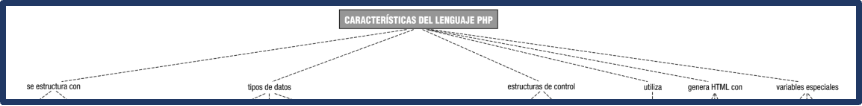

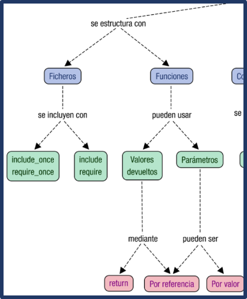

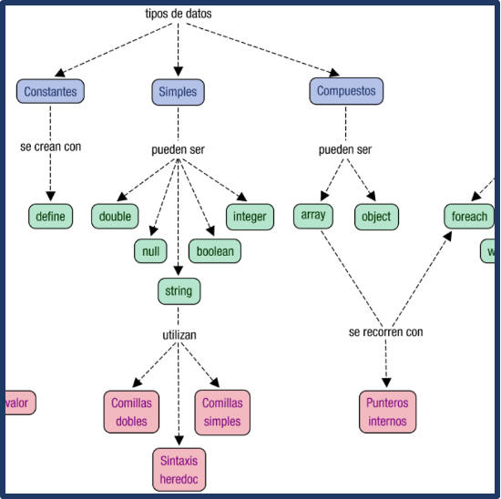

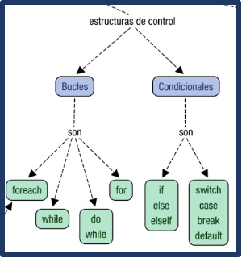

# Actividad Entregable

!!! success "Entregable"

    Tienes la info en la sección "[Actividad entregable](Entregable.md)"

## Presentación

<iframe src="https://docs.google.com/presentation/d/e/2PACX-1vTOqVQeiFTv4JsMc2KodRe5v61EUwjYl9C3X6pZ8pmGD0g_mims3oSFnUs2rEMNzFYmdF9q__Z0v6dr/pubembed?start=false&loop=false&delayms=60000" frameborder="0" width="960" height="569" allowfullscreen="true" mozallowfullscreen="true" webkitallowfullscreen="true"></iframe>
