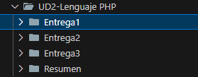
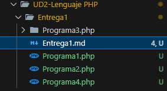
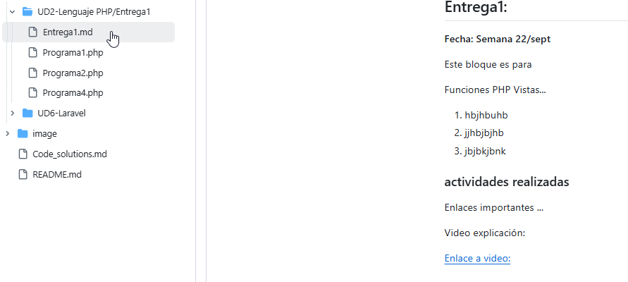
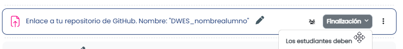

# **Entrega 1**

Iremos creando las diferentes carpetas y archivos PHP bajo la ruta

```
dwes/UD2/Sesion1/
```

* así como su documentación en formato **Markdown (Sesion1.md, Sesion2.md)** en cada directorio
* Subir al menos un **commit semanal** a Moodle con los cambios y archivos añadidos, comentando el código debidamente, con algunas capturas de pantalla
* Investiga, profundiza, sé curioso, personaliza ...



En cada entrega podrá haber varios scripts php o incluso carpetas, que se llamarán por defecto Programa1.php, 2,3 ...

### README: Sesion1.php/Sesion2....

El readme se realizará por semanas/entregas y, en lugar de readme.md, lo llamaremos Sesion1, Sesion2.md ....



Tu repositorio se verá así:



## Personaliza

Cada ejemplo, para que quede claro que es de tu autoría / personalización


## Clases de la semana:

1. Instalación entorno PHP
2. Síntaxis básica, ámbitos de las variables ...
3. Mostrando info por pantalla, funciones especiales de PHP...

## Creación de un repositorio Git Hub

Hay que subir el enlace de dicho repositorio a **Moodle**.



Los ejercicios que se han de subir al repositorio Github y enlace al aula Moodle serán:

1. Repositorio **Github** público y envía el enlace a través de Moodle.
2. El código README debe contener **CAPTURAS DE PANTALLA**
3. Crea los archivos y carpetas que se hayan visto durante las explicaciones de las diferentes características del lenguaje PHP, tanto los ejemplos como aquellas otras pruebas que consideres.
4. Comenta en archivos "**Sesion1.md, Sesion2.md**"...  algunas de estas características y muestra capturas con los resultados.
5. En clase podremos exponer nuestro código en cualquier momento

---

!!! info "**Entrega 1**"

    Se ha de entregar en el tiempo estimado en Moodle
