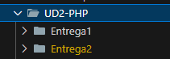

## **==Entrega== 2**

!!! abstract "==Entrega== 2"

    En esta==entrega== hemos trabajado las sesiones de:

    4 Control

    5 Funciones

    6 Arrays

    7 Interacción de PHP con**formularios** HTML

## 1 Ruta de trabajo

Iremos creando las diferentes carpetas y archivos PHP bajo la ruta

```
dwes/UD2/Sesion4/
```

* así como su documentación en formato **Markdown (==Sesion4==.md, ==Sesion5==.md)** en cada directorio
* Subir al menos un **commit semanal** a Moodle con los cambios y archivos añadidos, comentando el código debidamente, con algunas capturas de pantalla
* Investiga, profundiza, sé curioso, personaliza ...



En cada ==entrega== podrá haber varios scripts php o incluso carpetas, que se llamarán por defecto Programa1.php, 2,3 ...

## 2 Repositorio Git Hub

Hay que subir el enlace de la ruta de  "==Entrega==2.md" de tu repositorio a **Moodle**.

Los ejercicios que se han de subir al repositorio Github y enlace al aula Moodle serán:

1. Repositorio **Github** público y envía el enlace a través de Moodle.
2. El código README debe contener **CAPTURAS DE PANTALLA**
3. Crea los archivos y carpetas que se hayan visto durante las explicaciones de las diferentes características del lenguaje PHP, tanto los ejemplos como aquellas otras pruebas que consideres.
4. En clase podremos exponer, explicar, debatir nuestro código en cualquier momento

## **3 Proyecto de la unidad 2**

Crea una carpeta con un Proyecto de HTML + PHP y que recoja lo más importante que has aprendido durante la unidad

* Debe ir contenido en la carpeta **/dwes/UD2/Proyecto**


!!! note "==Entrega== 2"

    Realizamos commit,**exportamos la documentación en PDF** y se ha de ==entrega==r junto con el enlace a **GITHUB** en el tiempo estimado en Moodle

---

## 4 Algunos vídeos cortos para pensar un poco ...

<iframe width="458" height="815" src="https://www.youtube.com/embed/8PSaSdFMkq0" title="Que metodología de estudio recomiendas?" frameborder="0" allow="accelerometer; autoplay; clipboard-write; encrypted-media; gyroscope; picture-in-picture; web-share" referrerpolicy="strict-origin-when-cross-origin" allowfullscreen></iframe>

<iframe width="458" height="815" src="https://www.youtube.com/embed/gTchZ1S3hMk" title="¿Voy a tener Éxito como Programador?" frameborder="0" allow="accelerometer; autoplay; clipboard-write; encrypted-media; gyroscope; picture-in-picture; web-share" referrerpolicy="strict-origin-when-cross-origin" allowfullscreen></iframe>

## 73 mejores canales Youtube para programar

[73 canales buenos para aprender a programar. Enlace](https://www.webreactiva.com/blog/mejores-canales-youtube-programacion#1-como-puedo-usar-youtube-para-aprender-desarrollo-de-software-de-manera-efectiva)

# Seguimos!


